# ★ 2.14 库内 AI Service 架构

> **一句话**：SQL 表达式 → endpoint 缓存 → libcurl HTTP → 外部模型服务。
> 一条同步的外呼链路，装在数据库的表达式求值框架里。



---

## 完整调用链

以 `AI_EMBED('my_model', content)` 为例
（`src/sql/engine/expr/ob_expr_ai/ob_expr_ai_embed.cpp:78`）：

```
ObExprAIEmbed::eval_ai_embed
  ↓ expr.eval_param_value(ctx, arg_model_id, arg_content)     取参数
  ↓ ObAIFuncUtils::get_ai_func_info(...)                       取模型元信息
  ↓ share::g_mp->ai_service()                                  拿 AI 服务（模块提供者）
  ↓ ai_service->get_ai_service_guard(ai_service_guard)         取守卫
  ↓ guard.get_ai_endpoint_by_ai_model_name(model_id, ep)       查 endpoint
  ↓ ObAIFuncModel model(alloc, *info, *endpoint_info)
  ↓ model.call_dense_embedding(content, config, result)
  ↓ ObAIFuncClient::send_post(...)                             libcurl
  ↓ 外部模型服务
  ↓ ObAIFuncUtils::set_string_result(expr, ctx, res, result)   写结果
```

注意第 3 步用的是 `share::g_mp`——
这就是 [2.1](01-layering-and-startup.md) 讲的全局模块提供者。
表达式层（layer 3）通过它访问 observer 层（layer 5）的 AI 服务，
不违反分层规则。

---

## 分层结构

### 表达式层：`src/sql/engine/expr/ob_expr_ai/`

四个函数类，都继承 `ObFuncExprOperator`：

| 类 | 函数 | 类型枚举 |
|---|---|---|
| `ObExprAIEmbed` | `AI_EMBED` | `T_FUN_SYS_AI_EMBED = 2083` |
| `ObExprAIRerank` | `AI_RERANK` | `T_FUN_SYS_AI_RERANK = 2084` |
| `ObExprAIComplete` | `AI_COMPLETE` | `T_FUN_SYS_AI_COMPLETE` |
| `ObExprAIPrompt` | `AI_PROMPT` | `T_FUN_SYS_AI_PROMPT` |

### 接口抽象：`ob_ai_func.h`

一组纯虚基类，把"不同类型模型的请求怎么构造、响应怎么解析"抽象出来：

```cpp
class ObAIFuncBase {
  virtual int get_header(allocator, api_key, headers) = 0;
  virtual int parse_output(allocator, http_response, result) = 0;
};

class ObAIFuncIComplete : public ObAIFuncBase {
  virtual int get_body(alloc, model, prompt, content, config, body) = 0;
  virtual int set_config_json_format(alloc, config) = 0;
};

class ObAIFuncIEmbed : public ObAIFuncBase {
  virtual int get_body(alloc, model, contents, config, body) = 0;
};

class ObAIFuncIRerank : public ObAIFuncBase {
  virtual int get_body(alloc, model, query, document_array, config, body) = 0;
};
```

这个设计让适配不同厂商的 API 格式成为可能——
`provider` 字段（如 `openai`）决定用哪个实现。

`ObAIFuncExprInfo`（`ob_ai_func.h:34`）是挂在表达式上的额外信息：

```cpp
struct ObAIFuncExprInfo : public ObIExprExtraInfo {
  common::ObString name_;          // endpoint 名
  share::EndpointType::TYPE type_; // 类型
  common::ObString model_;         // 模型名
};
```

### HTTP 层：`ObAIFuncClient`

`ob_ai_func_client.h:28`，基于 **libcurl**：

```cpp
class ObAIFuncClient : public ObAIFuncHandle
{
  int send_post(allocator, url, headers, data, response);
  int send_post_batch(allocator, url, headers, data_array, responses);
  int send_post_batch_no_wait(data_array);      // 异步批量
  bool check_batch_finished();
  int get_batch_result(responses);
private:
  CURLM *curlm_;                    // curl multi 句柄
  CURL  *curl_;
  ObArray<CURL *> curl_handles_;
  std::atomic<bool> is_finished_;
  int64_t max_retry_times_;         // 默认 3
  int64_t abs_timeout_ts_;
  int64_t timeout_sec_;             // 默认 60
};
```

默认值在构造函数（`ob_ai_func_client.cpp:26`）：

```cpp
max_retry_times_ = 3;   // default retry 3 times
timeout_sec_     = 60;  // default timeout 1 minute
```

用 **curl multi** 接口支持并发批量请求
（`send_post_batch_no_wait` + `check_batch_finished` + `get_batch_result`
是一组非阻塞 API），这对批量向量化很重要。

还有 `is_retryable_status_code(http_code)` 判断哪些 HTTP 状态码值得重试。

---

## 元信息管理

### 类型体系

`src/share/ai_service/ob_ai_model_info.h`：

```cpp
struct EndpointType {
  enum TYPE {
    INVALID_TYPE     = 0,
    DENSE_EMBEDDING  = 1,
    SPARSE_EMBEDDING = 2,
    COMPLETION       = 3,
    RERANK           = 4,
    MAX_TYPE
  };
};

class ObAiServiceModelInfo { name_; type_; model_name_; };
```

### 两级注册：模型 + endpoint

seekdb 把"模型"和"连接方式"分成两个对象：

```
AI MODEL         逻辑模型：叫什么、什么类型、底层模型名
   ↓ 1:N
AI MODEL ENDPOINT  物理连接：URL、API Key、provider、请求模型名
```

好处是同一个逻辑模型可以配多个 endpoint（不同区域、不同供应商），
应用侧的 SQL 不用改。

`ObAiServiceExecutor`（`src/observer/ai_service/ob_ai_service_executor.h:34`）
负责 endpoint 的生命周期：

```cpp
static int create_ai_model_endpoint(allocator, endpoint_name, create_jbase);
static int alter_ai_model_endpoint(allocator, endpoint_name, alter_jbase);
static int drop_ai_model_endpoint(endpoint_name);
static int read_ai_endpoint(allocator, endpoint_name, endpoint_info);
static int read_ai_endpoint_by_ai_model_name(allocator, ai_model_name, endpoint_info);
```

注意参数是 `ObIJsonBase`——**配置以 JSON 传入**，
这也是为什么用户侧的语法是
`CREATE_AI_MODEL_ENDPOINT('name', '{...json...}')`。

私有成员里有版本管理的痕迹：

```cpp
static const int64_t SPECIAL_ENDPOINT_ID_FOR_VERSION;
static int lock_and_fetch_endpoint_version(ObMySQLTransaction &trans, int64_t &endpoint_version);
static int insert_special_endpoint_for_version(ObMySQLTransaction &trans);
```

用一条特殊记录做版本号，配合事务加锁——
这是为了让各节点/各会话能感知 endpoint 配置变更。

### 运行时缓存

`omt::ObAiService`（`src/observer/omt/ob_ai_service.cpp`）
缓存 endpoint 信息，避免每次调用都查内部表。
`ObAiServiceGuard` 是 RAII 守卫，保证读取期间缓存不被换掉。

### 用户接口

PL 系统包 `DBMS_AI_SERVICE`：
- 声明：`src/share/inner_table/sys_package/dbms_ai_service_mysql.sql`
- 实现：`src/pl/sys_package/ob_dbms_ai_service.cpp`

视图：`oceanbase.DBA_OB_AI_MODELS`、`oceanbase.DBA_OB_AI_MODEL_ENDPOINTS`。

用法见 [1.5 库内 AI](../10-user/05-in-db-ai.md)。

---

## 另一条路：索引侧自动 embedding

除了显式调 `AI_EMBED`，向量索引可以配 `model=` 参数，
让引擎自动为新行生成向量：

```sql
create vector index vec_idx1 on t_vec(c2)
  with (distance=l2, type=hnsw, model=ob_embed, dim=1024, sync_mode=immediate);
```

实现是 `ObEmbeddingTask`
（`src/observer/vector_index/ob_vector_embedding_handler.cpp`），
一个阶段状态机：

```
OB_EMBEDDING_TASK_INIT → HTTP_SENT → HTTP_COMPLETED → PARSED → DONE
```

配套的索引类型 `INDEX_TYPE_HYBRID_INDEX_EMBEDDED_LOCAL = 42`，
异步任务类型 `OB_VECTOR_ASYNC_HYBRID_VECTOR_EMBEDDING`。

这条路比显式调用更适合"持续写入自动向量化"的场景——
它走异步任务，不阻塞写入。

---

## 架构评价

### 值得肯定的设计

- **分层清晰**：表达式 / 接口抽象 / HTTP 客户端 / 元信息，各司其职
- **模型与 endpoint 分离**：配置灵活
- **curl multi 批量**：为吞吐做了准备
- **provider 抽象**：能适配不同厂商 API
- **走 `g_mp`**：没有破坏模块分层

### 需要注意的风险

**1. 同步外呼在 SQL 执行路径上**

`AI_EMBED` 是在表达式求值时**同步**发 HTTP 的。
一条 `SELECT AI_EMBED(...) FROM big_table` 会产生大量外部调用，
每个最长等 60 秒。这意味着：

- 查询耗时不可控，取决于外部服务
- 工作线程被阻塞在网络 IO 上
- 外部服务抖动会直接传导成数据库查询抖动

生产使用务必控制批量规模，或改走索引侧的异步 embedding。

**2. 计划缓存的 schema 版本匹配未完成**

`ob_expr_ai_embed.cpp:159` 有明确的 TODO：

```cpp
// TODO: support schema version match in plan cache for ai func
```

下面一整段取模型信息并挂到 `rt_expr.extra_info_` 的代码被注释掉了。
含义是：**改了 endpoint 配置后，计划缓存里的老计划可能不会自动失效**。
遇到"改了配置不生效"，先清计划缓存。

**3. API Key 的存储**

endpoint 的 `access_key` 存在内部表里。
测试用例里能看到它可以被查询出来对比：

```sql
select ..., ACCESS_KEY = 'sk-xxxxxxxxxxxx', ... from oceanbase.DBA_OB_AI_MODEL_ENDPOINTS ...
```

*（出处：`ai_function/t/ai_model_endpoint_ddl.test`）*

生产部署要注意这张视图的访问权限。

---

## 代码锚点

| 文件:行 | 职责 |
|---|---|
| `src/sql/engine/expr/ob_expr_ai/ob_expr_ai_embed.cpp:78` | `eval_ai_embed` 主链路 |
| `src/sql/engine/expr/ob_expr_ai/ob_expr_ai_embed.cpp:159` | 计划缓存 TODO |
| `src/sql/engine/expr/ob_expr_ai/ob_ai_func.h:34` | `ObAIFuncExprInfo` |
| `src/sql/engine/expr/ob_expr_ai/ob_ai_func.h:59-117` | 四个接口基类 |
| `src/sql/engine/expr/ob_expr_ai/ob_ai_func_client.h:28` | `ObAIFuncClient` |
| `src/sql/engine/expr/ob_expr_ai/ob_ai_func_client.cpp:26` | 重试 3 次 / 超时 60s |
| `src/observer/ai_service/ob_ai_service_executor.h:34` | endpoint CRUD |
| `src/observer/ai_service/ob_ai_service_proxy.cpp` | 服务代理 |
| `src/share/ai_service/ob_ai_model_info.h` | `EndpointType` |
| `src/observer/omt/ob_ai_service.cpp` | 运行时缓存 |
| `src/pl/sys_package/ob_dbms_ai_service.cpp` | `DBMS_AI_SERVICE` |
| `src/observer/vector_index/ob_vector_embedding_handler.cpp` | 索引侧异步 embedding |
| `src/objit/include/objit/common/ob_item_type.h:915-916` | 类型枚举 2083/2084 |

---

## 动手验证

看完整的求值链路（约 75 行，很值得通读）：

```bash
sed -n '78,152p' src/sql/engine/expr/ob_expr_ai/ob_expr_ai_embed.cpp
```

看接口抽象：

```bash
sed -n '59,120p' src/sql/engine/expr/ob_expr_ai/ob_ai_func.h
```

看 HTTP 客户端的重试与超时：

```bash
sed -n '24,40p' src/sql/engine/expr/ob_expr_ai/ob_ai_func_client.cpp
```

看计划缓存的 TODO：

```bash
sed -n '154,192p' src/sql/engine/expr/ob_expr_ai/ob_expr_ai_embed.cpp
```

---

## 延伸阅读

- 第 2 篇到此结束。
- [1.5 库内 AI 函数](../10-user/05-in-db-ai.md) —— 用户视角与完整语法
- [3.6 实战一：新增 SQL 函数](../30-developer/06-hands-on-sql-function.md) —— 照 `AI_EMBED` 造一个
- [★ 2.10 向量索引架构](10-vector-index.md) —— 索引侧 embedding 的落点
