# 3.1 环境与构建

> **一句话**：`bash build.sh debug --init --make` 一条命令搞定；
> 但第一次跑要有心理准备——下载全部依赖 + 编译 281 万行 C++。



---

## 最短路径

```bash
git clone https://github.com/oceanbase/seekdb.git
cd seekdb
bash build.sh debug --init --make

mkdir -p ~/seekdb/bin
cp build_debug/src/observer/seekdb ~/seekdb/bin
cd ~/seekdb
./bin/seekdb
```
*出处：`README.md` / `docs/developer-guide/en/build-and-run.md`*

> ⚠️ 请用一个**全新的空目录**做工作目录。seekdb 会在当前目录创建
> `store/`、`log/`、`run/` 等，混在已有目录里很难清理。

---

## `build.sh` 全解

### 命令形式

```
./build.sh -h
./build.sh init
./build.sh clean
./build.sh [BuildType] [--init] [--make [MakeOptions]]
./build.sh [BuildType] [--init] [--ob-make [MakeOptions]]
```

### 14 种构建模式

从 `build.sh` 的 case 分支（行 237-280）可以完整列举：

| 模式 | 行 | 用途 |
|---|---|---|
| `debug` | 246 | **默认**，带断言和调试信息 |
| `debug_no_unity` | 249 | 关闭 unity build，编译慢但报错精确 |
| `release` | 237 | 生产优化 |
| `release_no_unity` | 240 | 同上，关 unity |
| `release_embedded` | 243 | **嵌入式形态** |
| `rpm` | 271 | 打 RPM 包 |
| `deb` | 277 | 打 DEB 包 |
| `tgz` | 274 | 打 tar.gz |
| `package` | 280 | 通用打包 |
| `ccls` | 252 | 仅生成 ccls 索引（IDE 用） |
| `clangd` | 257 | 仅生成 clangd 索引 |
| `perf` | 262 | 性能分析构建 |
| `mac_perf` | 265 | macOS 性能分析 |
| `errsim` | 268 | 错误注入测试构建 |

附加开关：

| 开关 | 作用 |
|---|---|
| `--init` | 拉取第三方依赖（首次必须） |
| `--make` / `--ob-make` | 拉完直接编译 |
| `--android` | 交叉编译 Android（arm64-v8a） |
| `--coverage` | 打开 clang source-based coverage（同时关闭 BOLT） |

### 关于 unity build

seekdb 默认用 unity build（把多个 `.cpp` 合并成一个编译单元）加速编译。
副作用是**报错位置可能不准**。改代码时如果编译错误看不懂，
换成 `debug_no_unity` 重编。

---

## `--init` 到底做了什么

依赖不走 apt/yum，而是 seekdb 自己的一套：

```
deps/init/dep_create.sh
  ↓ 识别 OS + 架构
deps/init/oceanbase.<os>.<arch>.deps     依赖清单
  ↓ 从 mirrors.oceanbase.com 下载 RPM
rpm2cpio | cpio -di  →  deps/3rd/
```

支持的平台清单（`deps/init/` 下的 `.deps` 文件）：

```
oceanbase.el7.{x86_64,aarch64}.deps       CentOS/RHEL 7
oceanbase.el8.{x86_64,aarch64}.deps       CentOS/RHEL 8
oceanbase.el9.{x86_64,aarch64}.deps       CentOS/RHEL 9
oceanbase.al8.{x86_64,aarch64}.deps       Alibaba Cloud Linux 8
oceanbase.macos{,13,15}.arm64.deps        macOS Apple Silicon
oceanbase.windows.x86_64.deps             Windows
oceanbase.android.arm64.deps              Android
```

### 会拉下来什么

以 `oceanbase.el8.x86_64.deps` 为例，第三方依赖包括：

| 类别 | 组件 |
|---|---|
| **向量** | **vsag**（向量索引核心库）、roaringbitmap/croaring |
| 测试 | gtest |
| 网络/加密 | libcurl-static、openssl-static、grpc、protobuf-c |
| 数据结构 | boost 1.74、abseil-cpp、fast-float |
| 压缩 | zlib-static、xz |
| 地理 | s2geometry、icu |
| 其他 | libunwind、libaio、libxml2、rapidjson、sqlite、jemalloc |
| 工具链 | obdevtools-{binutils,bison,ccache,cmake,flex,gcc} |

注意工具链本身也是下载来的（`obdevtools-*`）——
所以你不需要系统装特定版本的 gcc/cmake。

> 💡 **vsag 是外部依赖**，不在本仓库源码里。
> 仓库里只有适配层 `deps/oblib/src/lib/vector/ob_vsag_adaptor.cpp`。
> 想深入 HNSW 实现细节要去看 vsag 项目。

---

## 系统前置依赖

从 `docs/developer-guide/en/toolchain.md`：

**Linux（RPM 系）**：
```bash
yum install git wget rpm rpm-build cpio make glibc-devel binutils m4 libtool python3
```

**Debian / Ubuntu**：
```bash
apt install git wget rpm rpm2cpio cpio build-essential binutils m4 file python3
# Ubuntu 24.04+ / Debian 13+ 还需要
apt install libaio1t64
```

**macOS**：仅支持 macOS 13+ 的 Apple Silicon。
`build.sh` 会用 `/opt/homebrew/bin/cmake`。

**Windows 11 x64**：走 `build.ps1`，依赖 vcpkg + LLVM + OpenSSL。

官方支持的发行版列表很长（Alibaba Cloud Linux 3、CentOS 7/8/9、
Debian 11/12/13、Fedora 33、Kylin V10、openSUSE 15.2、OpenAnolis 8/23、
OpenEuler 22.03/24.03、Rocky 8/9、SUSE 15.2、Ubuntu 20.04/22.04/24.04、UOS 20）。

---

## CMake 层做了什么

根 `CMakeLists.txt` 要点：

```cmake
project(OceanBase VERSION 1.3.0.0 LANGUAGES CXX C ASM)
```

C++20。关键的子模块：

| 文件 | 职责 |
|---|---|
| `cmake/Env.cmake` | 编译器选择（clang-17）、架构、警告、Thin-LTO、AutoFDO、jemalloc |
| `cmake/Rust.cmake` | 编译 `rust/sql-nio` 成静态库 |
| `cmake/Jemalloc.cmake` | jemalloc 配置 |
| `cmake/RPM.cmake` / `DEB.cmake` / `TGZ.cmake` / `WIX.cmake` | 各平台打包 |
| `cmake/module_check/` | **模块分层 DAG 检查** |

### 模块分层守卫

这是值得单独强调的机制：

```cmake
# seekdb 目标自动依赖 module_layer_check
```

`cmake/module_check/module_layer_check.py` 会扫描
`deps/oblib/src/{lib,common,rpc,grpc}` 和 `src/share`，
验证 include 关系不违反 `module_layers.conf` 里的分层。
**向上依赖会让构建失败。**

存量违规记录在 `module_layer_baseline.txt`——
新代码不许再增加违规，老债慢慢还。

详见 [0.3 代码地图](../00-orientation/03-code-map.md)。

### AutoFDO / 性能优化

`profile/` 目录下有 `observer-x86_64.prof`、`observer-aarch64.prof`
和 `hotfuncs-*.txt`，用于 AutoFDO 采样反馈优化和热函数排布，
由 `cmake/Env.cmake` 接入。

---

## 跨平台构建

### Android

```bash
bash build.sh release --android --init --make
```

要点（`docs/developer-guide/en/android.md`）：

- 需要 NDK r27
- `-DANDROID_ABI=arm64-v8a -DANDROID_PLATFORM=android-28`
- 强制 include `include/android_compat.h`（boost 兼容宏）
- **必须用 NDK 的 llvm-strip**，不能用 macOS 自带的 `strip`
- 单元测试合并成一个 `all_tests` 二进制（所有 `TEST()` 宏自动注册）

### Windows

```powershell
.\build.ps1
```

`build.ps1` 的函数：`Do-Init`、`Do-Build`、`Do-Pack`、
`Do-BuildConfigurator`、`Do-Ninja`、`Do-Package`。
支持通过 `SM_API_KEY` 环境变量做 DigiCert 代码签名，用 WiX 打 MSI。

---

## 运行起来

构建完之后有两条路。

### 路线 A：直接跑

```bash
mkdir -p ~/seekdb/bin && cp build_debug/src/observer/seekdb ~/seekdb/bin
cd ~/seekdb && ./bin/seekdb
```

### 路线 B：用 OBD（推荐做开发测试）

```bash
./tools/deploy/obd.sh prepare -p /tmp/obtest
./tools/deploy/obd.sh deploy -c ./tools/deploy/single.yaml
mysql -uroot -h127.0.0.1 -P10000
```
*出处：`docs/developer-guide/en/build-and-run.md`*

`obd.sh` 是个 670 行的包装脚本，提供
`deploy` / `start` / `stop` / `restart` / `destroy` / `mysqltest` /
`sysbench` / `tpcc` / `connect` / `display` 等子命令。

> ⚠️ 端口是 **10000** 不是 2881——原因见 [1.7 部署与配置](../10-user/07-deploy-config.md)。

清理：

```bash
./tools/deploy/obd.sh destroy --rm -n single
```

---

## IDE 配置

`docs/developer-guide/en/ide-settings.md` 的建议：

| 平台 | 推荐 |
|---|---|
| macOS / Linux | VSCode + **ccls** |
| Windows | Source Insight |

生成索引：

```bash
bash build.sh ccls     # 或 clangd
```

> ⚠️ ccls 和 clangd 在 unity build 下会打架，别同时开。

---

## 代码锚点

| 文件:行 | 职责 |
|---|---|
| `build.sh:41` | `usage` 帮助文本 |
| `build.sh:237-280` | 14 种构建模式的 case 分支 |
| `build.sh:152` | `do_init` |
| `build.sh:170` | `do_build` |
| `build.ps1` | Windows 构建 |
| `CMakeLists.txt` | 工程根，C++20，模块检查接线 |
| `cmake/Env.cmake` | 编译器/架构/LTO/AutoFDO |
| `cmake/Rust.cmake` | 编译 rust/sql-nio |
| `cmake/module_check/module_layer_check.py` | 分层守卫 |
| `deps/init/dep_create.sh` | 依赖下载 |
| `deps/init/oceanbase.*.deps` | 各平台依赖清单 |
| `tools/deploy/obd.sh` | 部署包装脚本 |
| `docs/developer-guide/en/toolchain.md` | 官方工具链要求 |
| `docs/developer-guide/en/android.md` | Android 交叉编译 |

---

## 动手验证

看全部构建模式：

```bash
grep -nE '^\s{4,6}x[a-z_0-9]+\)' build.sh
```

看当前平台会拉哪些依赖：

```bash
ls deps/init/*.deps
cat deps/init/oceanbase.el8.x86_64.deps | head -30
```

确认 vsag 是外部依赖：

```bash
grep -rn "vsag" deps/init/*.deps | head -3
ls deps/oblib/src/lib/vector/
```

---

## 延伸阅读

- 下一章：[3.2 oblib 基础设施](02-oblib.md)
- [0.2 三种形态](../00-orientation/02-three-modes.md) —— `release_embedded` 有什么不同
- [3.5 测试体系](05-testing.md) —— 构建完怎么跑测试
