# 3.5 测试体系

> **一句话**：两套测试——`unittest`（gtest，测单个类）和
> `mysqltest`（跑真 SQL 对比输出，53 个套件）。CI 把 mysqltest 切成 4 路并行。



---

## 单元测试：gtest

### 目录结构

两个 unittest 根目录，都镜像各自的源码结构：

```
unittest/                    对应 src/
├── sql/  storage/  share/  observer/  logservice/  pl/  rootserver/  lib/
├── mtlenv/                  测试环境搭建
├── all_tests_main.cpp       Android 合并二进制入口
├── run_tests.sh             ctest 包装
├── sql_quicktest.sh         SQL 层快速子集
└── CMakeLists.txt

deps/oblib/unittest/         对应 deps/oblib/
```

### 构建与运行

默认构建**不编译**测试，要显式做：

```bash
cd build_debug/unittest
make -j4
./run_tests.sh        # 底层是 ctest，单例超时 300s
```

跑单个用例：

```bash
cd build_debug
make -j4 test_chunk_row_store
./unittest/sql/engine/basic/test_chunk_row_store
```

SQL 层快速回归（parser / resolver / rewrite / optimizer / expr /
dml / px / aggregate / set / subquery / plan_cache / common）：

```bash
./unittest/sql_quicktest.sh
```

### 写一个测试

```cpp
#include <gtest/gtest.h>

TEST(SuiteName, case_name)
{
  ObSEArray<int64_t, 4> arr;
  ASSERT_EQ(OB_SUCCESS, arr.push_back(42));
  ASSERT_EQ(1, arr.count());
}
```

文件名 `test_xxx.cpp`，放到镜像 `src/` 的对应目录，
`CMakeLists.txt` 里用 `ob_unittest()` 宏注册。

### Mock 设施

`unittest/` 提供了一批 mock，避免测试时拉起整个数据库：

- `mockcontainer/`
- `mock_access_service.h`
- `mock_ls_tablet_service.h`
- `mock_multi_version_schema_service.h`
- `mock_ob_log_handler.h`
- `mock_gctx.h`

---

## 集成测试：mysqltest

这是 seekdb 测试体系的主力，也是**读代码时最好的文档来源**。

### 原理

一个用例 = 两个文件：

```
t/<name>.test      输入：一串 SQL 和指令
r/<name>.result    期望：执行后的完整输出
```

跑测试就是执行 `.test`，把实际输出和 `.result` 逐字节比对。

### 53 个套件

```
ai_function      array           config_test      datatype        ddl
deadlock_detector delete         executor         expr            foreign_key
fork_table       fts_index       geometry         global_index    groupby
hierarchical_query histogram     information_schema inner_table   insert
join             json            load_data        lob             major_freeze
map              merge_uncommitted meta_info      msdt            number
online_ddl       optimizer       parallel_ddl     pdml            pl
plan_cache       px              replace          security        skyline
static_engine    storage         subquery         sys_vars        system_variable
table_redefinition trx           type_date        update          vector_index
view             window_function yonyou_test
```

与 seekdb 特色能力直接相关的：

| 套件 | 用例数 | 内容 |
|---|---|---|
| `vector_index/` | 22 | 向量索引 DDL、查询、重建、稀疏向量 |
| `fork_table/` | 17 | FORK TABLE 各种场景 |
| `fts_index/` | 15 | 全文索引与分词器 |
| `ai_function/` | 5 | AI 模型注册、`ai_prompt` |
| `merge_uncommitted/` | 27 | ⚠️ 这是 **LSM 转储未提交数据**，不是 `MERGE TABLE` |

> 💡 上表最后一行是我在写作时踩的坑，记录下来：
> `merge_uncommitted` 听起来像 `MERGE TABLE`，其实是存储层的
> "转储含未提交事务的数据"。`MERGE TABLE ... STRATEGY` **没有测试覆盖**。

### 运行

全量：

```bash
./tools/deploy/obd.sh mysqltest -n test --all
```

单个用例：

```bash
./tools/deploy/obd.sh mysqltest -n test \
  --test-dir ./mysql_test/test_suite/vector_index/t \
  --result-dir ./mysql_test/test_suite/vector_index/r \
  --test-set vector_index_basic
```

### `.test` 文件里的指令

从真实用例里能学到的常用指令：

```sql
--disable_warnings          -- 关闭警告输出（让 result 稳定）
--enable_warnings
--echo 一段说明文字          -- 往 result 里打标记
--error 1235                -- 期望下一条语句报这个错
--error 0,11112             -- 期望成功或报 11112
--replace_regex /__idx_[0-9]*/__idx_vec/g   -- 正则替换（消除不稳定 ID）
--source mysql_test/test_suite/fork_table/include/quick_major.inc  -- 引入片段
connect (obsys,$OBMYSQL_MS0,root@sys,,oceanbase,$OBMYSQL_PORT);    -- 建连接
connection default;         -- 切换连接
sleep 3;
```

`--replace_regex` 很关键——像自增 ID、时间戳这类每次都变的东西
必须替换掉，否则测试永远不稳定。

`connect` / `connection` 让你在一个用例里模拟多个客户端，
配合 debug sync 就能测并发时序。

### 为什么说它是最好的文档

官方文档不写的语法细节，测试用例里全有。比如本书
[1.5 库内 AI](../10-user/05-in-db-ai.md) 那一章的
`DBMS_AI_SERVICE.CREATE_AI_MODEL` 完整语法，
就是从 `ai_function/t/ai_model_endpoint_ddl.test` 里读出来的——
README 里一个字都没提。

**读新特性先读它的测试用例**，这是本书反复用的方法。

---

## CI

### GitHub Actions

| workflow | 做什么 |
|---|---|
| `seekdb.yml` | 主流程：setup → compile → **4 路并行 mysqltest** → collect |
| `compile.yml` | ubuntu-22.04 编译 |
| `codeql.yml` | 每周一 CodeQL 安全扫描 |
| `rust-checks.yml` | `rust/**` 的 clippy `-D warnings` + RustSec 审计 |
| `mkbook.yml` | 文档站点构建 |
| `translate.yml` | 文档翻译 |
| `sync_master.yml` | 分支同步 |

主流程会把编译产物 `observer.zst` 存到 NFS 供下游 runner 使用，
mysqltest 切 4 片并行跑（`.github/script/seekdb/mysqltest_slice.sh`）。

### GitLab / 内部 farm

`.gitlab-ci.yml` 只是个路由层，触发下游模板
（默认 `farm_for_standalone`）。`.akfarm`、`.akperformancetest`
是内部农场的标记文件。

---

## 提 PR 前该跑什么

1. **编译过**（含 `debug_no_unity` 确认没有 unity 掩盖的错误）
2. **相关 unittest 过**
3. **相关 mysqltest 套件过** —— 改了向量就跑 `vector_index`，
   改了全文就跑 `fts_index`
4. 改了 Rust 代码，本地跑 `cargo clippy -- -D warnings`

---

## 代码锚点

| 文件 | 职责 |
|---|---|
| `unittest/CMakeLists.txt` | `ob_unittest()` 宏 |
| `unittest/run_tests.sh` | ctest 包装 |
| `unittest/sql_quicktest.sh` | SQL 层快速子集 |
| `unittest/all_tests_main.cpp` | Android 合并二进制 |
| `tools/deploy/mysql_test/test_suite/` | 53 个测试套件 |
| `tools/deploy/mysql_test/include/` | 可复用的 `.inc` 片段 |
| `tools/deploy/obd.sh` | `mysqltest` 子命令 |
| `.github/workflows/seekdb.yml` | 主 CI |
| `.github/script/seekdb/mysqltest_slice.sh` | 4 路分片 |
| `.gitlab-ci.yml` | farm 路由 |
| `docs/developer-guide/en/unittest.md` | 官方单测文档 |
| `docs/developer-guide/en/mysqltest.md` | 官方集成测试文档 |

---

## 动手验证

数套件和用例：

```bash
ls tools/deploy/mysql_test/test_suite/ | wc -l
for s in vector_index fork_table fts_index ai_function; do
  echo "$s: $(ls tools/deploy/mysql_test/test_suite/$s/t/*.test | wc -l)"
done
```

看一个用例长什么样（推荐从这个入手）：

```bash
sed -n '1,45p' tools/deploy/mysql_test/test_suite/vector_index/t/vector_index_basic.test
```

看 CI 怎么分片：

```bash
cat .github/script/seekdb/mysqltest_slice.sh
```

---

## 延伸阅读

- 下一章：[3.6 实战一：新增一个 SQL 内建函数](06-hands-on-sql-function.md)
- [3.4 调试武器库](04-debugging.md) —— debug sync 配合 mysqltest 测时序
- 官方文档：`docs/developer-guide/zh/mysqltest.md`
