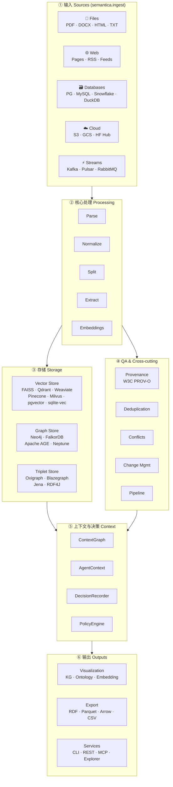
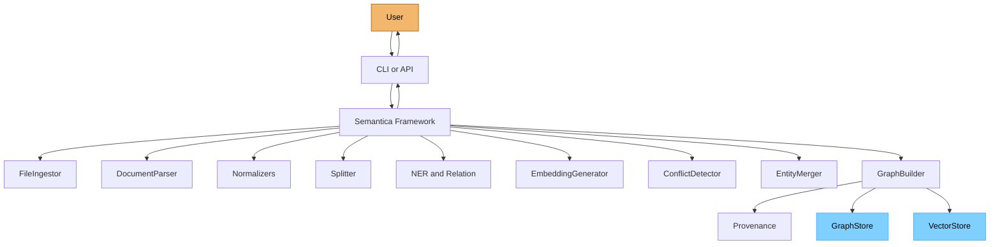

# ch-04 30,000 英尺架构图 — 6 大层与端到端数据流

> 本章给出 Semantica 的"骨架图": 一张高层架构 + 一张端到端数据流。所有后续章节都建立在本章定义的术语之上。

## 1. 用户视角(User)

### 1.1 我能用它做什么

- 一图看清"我的数据从哪进, 走到哪出"。
- 知道 6 大层(输入 / 处理 / 存储 / QA / 上下文 / 输出) 各解决什么问题。
- 在做选型时, 能对照图中"我的需求落在哪一层"。

### 1.2 一图概览 (FIG-01)

> 把图背下来, 后续所有章节都引用图中的节点名。


6 大层速记:

| 层 | 解决什么 | 用户接触面 |
|---|---|---|
| **1. 输入 (Sources)** | 从任意源头拉数据 | `semantica.ingest.*` (8 个 ingestor) |
| **2. 核心处理 (Processing)** | 清洗、抽取、嵌入 | `semantica.parse / normalize / split / semantic_extract / embeddings` |
| **3. 存储 (Storage)** | 落盘 (向量 + 图 + RDF) | `semantica.vector_store / graph_store / triplet_store` |
| **4. QA 与 Cross-cutting** | 去重、冲突、版本、流水线 | `semantica.deduplication / conflicts / change_management / pipeline` |
| **5. 上下文与决策 (Context)** | 把 AI 决策当成图节点 | `semantica.context / decision / policy` |
| **6. 输出 (Output)** | 可视化、导出、服务 | `semantica.visualization / export / explorer / cli / mcp` |

### 1.3 端到端数据流 (FIG-02)


一个 PDF 走过 `FileIngestor → DocumentParser → TextSplitter → NER → ConflictDetector → Dedup → KGBuilder → TripletStore → VectorStore → GraphStore [[ch-55-glossary]]` 的全程, 任何一层都可单独运行/替换。

### 1.4 何时跳到细节章

- 想用 ingest: [[ch-08-ingest]]
- 想用 LLM 抽取: [[ch-12-semantic-extract]]
- 想用图库: [[ch-18-graph-store]]
- 想用决策图: [[ch-21-context-decision]]

## 2. 开发者视角(Developer)

### 2.1 模块-包映射表

| 层 | Python 包 | 关键入口类 |
|---|---|---|
| 入口 | `semantica` | `_ModuleProxy` |
| Core | `semantica.core` | `Semantica` / `Config` / `LifecycleManager` |
| 输入 | `semantica.ingest` | `FileIngestor / WebIngestor / DBIngestor / ParquetIngestor / StreamIngestor` |
| 处理 | `semantica.parse` | `DocumentParser` |
| 处理 | `semantica.normalize` | `TextNormalizer / EntityNormalizer / DateNormalizer` |
| 处理 | `semantica.split` | `FixedChunker / SemanticChunker / GraphAwareChunker [[ch-55-glossary]]` |
| 处理 | `semantica.semantic_extract` | `NamedEntityRecognizer / RelationExtractor / TripletExtractor` |
| 处理 | `semantica.embeddings` | `EmbeddingGenerator / GraphEmbeddingManager` |
| 存储 | `semantica.vector_store` | `VectorStore / VectorIndexer / HybridSearch [[ch-55-glossary]]` |
| 存储 | `semantica.graph_store` | `GraphStore / NodeManager / QueryEngine` |
| 存储 | `semantica.triplet_store` | `TripletStore / BulkLoader` |
| QA | `semantica.provenance` | `ProvenanceManager` |
| QA | `semantica.deduplication` | `DuplicateDetector / EntityMerger` |
| QA | `semantica.conflicts` | `ConflictDetector / ConflictResolver` |
| QA | `semantica.change_management` | `EnhancedVersionManager` |
| QA | `semantica.pipeline` | `PipelineBuilder / ExecutionEngine` |
| 上下文 | `semantica.context` | `ContextGraph [[ch-55-glossary]] / AgentContext / DecisionRecorder` |
| 输出 | `semantica.visualization` | `KGVisualizer / OntologyVisualizer` |
| 输出 | `semantica.export` | `RDFExporter / ParquetExporter / ArrowExporter` |
| 服务 | `semantica.cli` | (Click group) |
| 服务 | `semantica.explorer` | (FastAPI app) |
| 服务 | `semantica.mcp_server` | (stdio MCP) |

### 2.2 关键代码路径

- `semantica/core/orchestrator.py:38` — `Semantica` 主类, 持有所有 lazy 模块引用。
- `semantica/__init__.py:48` — `_ModuleProxy` 实现 dot-notation。
- `semantica/core/lifecycle.py:59` — `LifecycleManager` 状态机。
- `semantica/core/config_manager.py:585` — `ConfigManager.merge_configs` (deep-merge 实现)。
- `semantica/core/config_manager.py:433` — `ConfigManager.load_from_file` (YAML/JSON 加载)。
- `semantica/core/config_manager.py:161` — `_load_from_env` (SEMANTICA_* env vars)。
- `semantica/cli.py:493` — Click 主 group。
- `semantica/server.py:63` — FastAPI 入口。
- `semantica/mcp_server/__init__.py:288` — MCP tools 列表。

### 2.3 依赖方向单向下沉

```
core → ingest/parse/normalize/split → semantic_extract → kg
                                                       → embeddings → vector_store
                                                       → ontology / reasoning
                                                       → provenance / change_management
                                                       → graph_store / triplet_store
                                                       → context (decision/policy)
                                                       → visualization / export
                                                       → pipeline (orchestrates all above)
```

**唯一允许的上行引用**: `context → kg / vector_store / embeddings / graph_store / provenance / conflicts`。
其它任何"反向依赖"都是 smell, 应当通过接口注入解决。

### 2.4 最小复现脚本

```python
# examples/ch-04-quick-sanity.py mirror
from semantica import Semantica

fw = Semantica()
try:
    # 触发各 lazy 模块
    _ = fw.embedding_generator      # 触发 embeddings
    _ = fw.reasoner                  # 触发 reasoning
    _ = fw.graph_builder             # 触发 kg
    _ = fw.document_parser           # 触发 parse
    _ = fw.file_ingestor             # 触发 ingest
    _ = fw.pipeline_builder          # 触发 pipeline
    print("✓ All 6 lazy modules instantiated.")
finally:
    fw.shutdown()
```

### 2.5 扩展点

- 想加新一层: 在 `core/orchestrator.py:117-227` 的 lazy property 加 `@property def my_layer`。
- 想换某一层实现: 注入 `config["processing"]["my_layer_backend"] = "custom"`, 在 `_initialize_modules` 路由。
- 想旁路某层: 调用子模块 API 而不走 `build_knowledge_base` (如直接 `semantica.kg.GraphBuilder [[ch-55-glossary]]`).

## 3. 架构师视角(Architect)

### 3.1 设计取舍

**为什么是 6 层而不是 3 层 (I/O/处理/存储) 或 8 层?**
- 3 层太粗: 不能体现"QA/上下文"在 AI 治理场景中的重要性。
- 8 层太细: 让初学者迷路。Semantica 的核心差异点是"决策图", 必须独立成层 (Context & Decision), 但其它细节归并到 6 大类。
- QA 与 Cross-cutting 合并: 因为 `pipeline / change_management / conflicts / deduplication / provenance` 都属于"为前面三层保驾护航", 独立成层会让"主链路"看起来太短。

**为什么存储层拆成"向量 / 图 / RDF"三个独立概念?**
- 三类存储的访问模式不同 (ANN vs traversal vs SPARQL), 强行合并会让 API 退化为最小公倍数。
- 但三者在 `ContextGraph` 之上做"统一视图", 这就是为什么 `context` 是单独一层 — 它是三层存储的"汇流处"。

### 3.2 与同类系统对比

| 维度 | Semantica 6 层 | LangChain 4 类 (Models/Prompts/Indexes/Chains) | LlamaIndex 5 模块 | Neo4j 生态 3 圈 (Core/Connectors/Graph Data Science) |
|---|---|---|---|---|
| 颗粒度 | 6 层 / 27 包 | 4 类 / 200+ 类 | 5 模块 | 3 圈 / 30+ lib |
| 治理 (Provenance / Policy) | 一等公民 | 缺 | 缺 | 仅数据库层 |
| 多存储统一视图 | ✅ ContextGraph | ❌ | ⚠ 弱 | ❌ |
| 流水线编排 | ✅ PipelineBuilder | ⚠ LCEL | ⚠ QueryPipeline | ❌ |

### 3.3 何时重新设计 / 拆层**: 当

- 任何一层代码行数 > 5k → 拆子层 (例: ingest 已隐含 streaming, 可拆 `ingest-batch` / `ingest-stream`)。
- 跨层循环依赖出现 ≥ 3 次 → 抽公共接口层 (例: `core.interfaces`)。
- 用户普遍"找不到入口" → 合并层 (例: 把 QA 折入上下文, 强调"决策治理")。

## 本章图表

### FIG-01 高层系统架构图



图说: Semantica 6 大层的分层数据流, 任何一层都可旁路; ContextGraph 是存储与 QA 的汇流处。

### FIG-02 端到端数据流 (一次 PDF 处理全程)



图说: 一次 `build_knowledge_base` 的端到端数据流, 实线箭头表调用, 蓝色节点为存储层, 橙色为用户。

## 跨章引用

- 上一章: [[ch-02-three-perspectives]]
- 数据模型细节: [[ch-05-data-models]]
- 最小示例: [[ch-06-quickstart-three-flows]]
- 配置: [[ch-07-configuration-primer]]