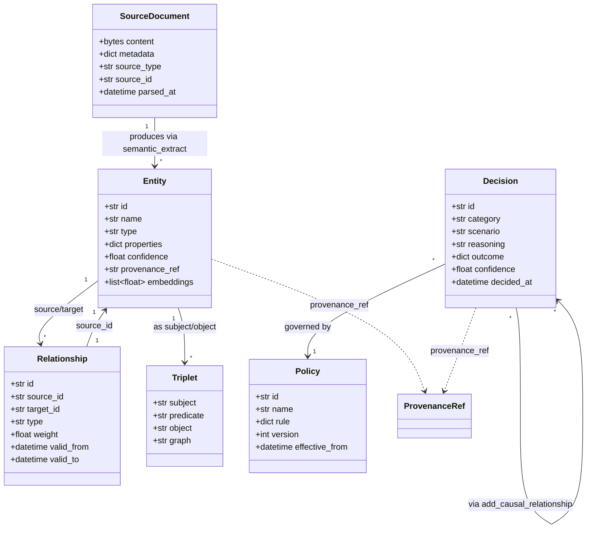
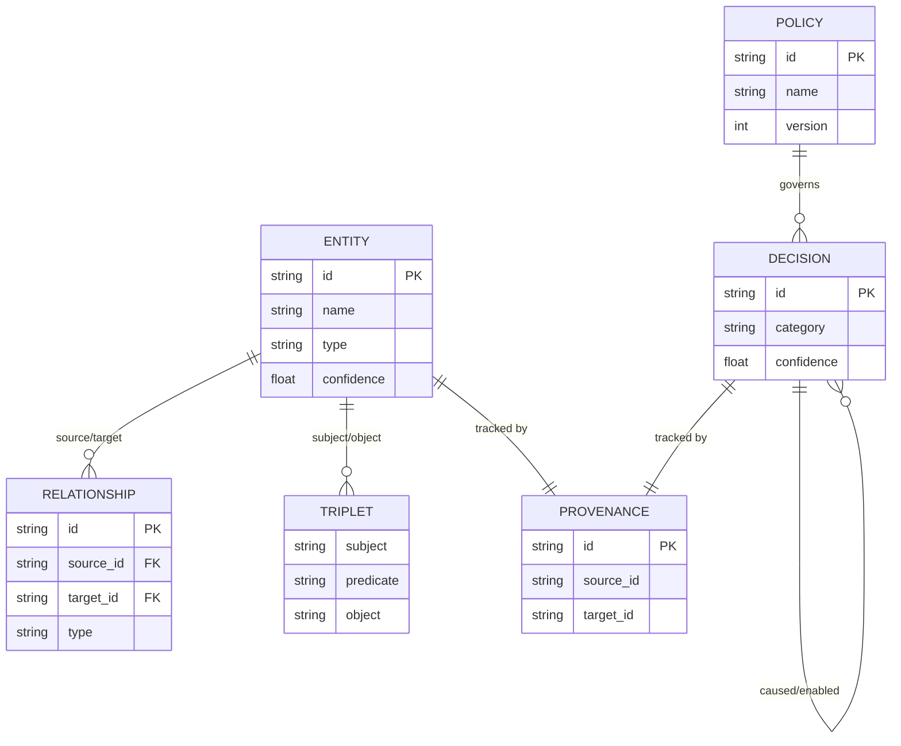

# ch-05 核心数据模型 — 6 个一等对象

> 整个 Semantica 围绕 6 个"一等对象"运转: `SourceDocument / Entity / Relationship / Triplet / Decision / Policy`。本章定义它们的字段、生命周期、跨层传递路径。

## 1. 用户视角(User)

### 1.1 我能用它做什么

- 知道"我手里这份数据是几号对象、字段长什么样、能转给谁"。
- 知道如何把数据从一层传到另一层 (例如 `Entity → graph_store.create_node()`)。
- 知道为什么"决策"也是图节点 (而不是元数据)。

### 1.2 6 个一等对象速记

| 对象 | 出现于 | 举例 |
|---|---|---|
| **SourceDocument** | ingest 输出 | 一份 PDF, 一个网页, 一行 Snowflake 查询结果 |
| **Entity (实体)** | semantic_extract 输出 / graph_store 输入 | "Albert Einstein", "E = mc²", "专利#US123" |
| **Relationship (关系)** | semantic_extract 输出 / graph_store 输入 | "Einstein → discovered → 相对论" |
| **Triplet (三元组)** | triplet_store 输入 | `(Einstein, discovered, 相对论)` |
| **Decision (决策)** | context 输出 / graph_store 输入 | "审批 100 万贷款" |
| **Policy (策略)** | context 输入 | "贷款 > 50 万需双签" |

> 6 对象关系速记 (ASCII):

```
SourceDocument ──(parse)──▶ ParsedDocument
                              │
                              ├─(semantic_extract)──▶ Entity / Relationship
                              │                            │
                              │                            ├─(dedup)──▶ deduped Entity
                              │                            │
                              │                            └─(KG build)──▶ Node / Edge
                              │
                              └─(record_decision)──▶ Decision ──▶ Policy
```

详见 [[ch-04-architecture-30kft]] FIG-01/02。

### 1.3 何时关心哪一类

- **抽取阶段**: 主要产生 / 消费 Entity + Relationship。
- **存储阶段**: 主要产生 / 消费 Triplet (RDF) 或图节点 (LPG)。
- **决策治理**: 关心 Decision + Policy + Causal Edge (Relationship 的特化)。
- **审计**: 关心每条 Entity/Relationship/Decision 都挂着的 `provenance_ref`。

## 2. 开发者视角(Developer)

### 2.1 公开字段表

#### SourceDocument

```python
@dataclass
class SourceDocument:
    content: bytes                       # 原始字节流
    metadata: dict[str, Any]             # 来源信息 (URL, 时间戳, hash...)
    source_type: str                     # "file" | "web" | "db" | "stream" | "cloud"
    source_id: str                       # 全局唯一 ID (sha256 normalized path)
    parsed_at: datetime                  # ingest 时间
```

#### Entity

```python
@dataclass
class Entity:
    id: str                              # 节点 ID (uuid4 or content-hash)
    name: str                            # "Albert Einstein"
    type: str                            # "PERSON" / "ORG" / "TECH" / "CONCEPT" ...
    properties: dict[str, Any]           # {"birth_year": 1879}
    confidence: float                    # 0.0-1.0
    provenance_ref: str | None           # 指向 ProvenanceManager 的 source_id
    embeddings: list[float] | None       # 可选预计算 embedding
    created_at: datetime
    updated_at: datetime
```

#### Relationship

```python
@dataclass
class Relationship:
    id: str
    source_id: str                       # Entity.id
    target_id: str                       # Entity.id
    type: str                            # "discovered" / "works_at" / "cites" ...
    properties: dict[str, Any]
    confidence: float
    provenance_ref: str | None
    bidirectional: bool                  # 影响 graph_store 边模型
    weight: float                        # 默认 1.0
    valid_from: datetime | None           # 时序
    valid_to: datetime | None
```

#### Triplet (RDF 风格)

```python
@dataclass
class Triplet:
    subject: str                         # URI or literal
    predicate: str                       # URI
    object: str | None                   # URI
    object_literal: str | None           # 字面量 (与 object 二选一)
    graph: str | None                    # named graph URI (四元组)
    provenance_ref: str | None
```

#### Decision

```python
@dataclass
class Decision:
    id: str                              # "dec-<uuid>"
    category: str                        # "credit_approval" / "diagnosis" ...
    scenario: str                        # 自由文本描述
    reasoning: str                       # 自然语言
    outcome: dict[str, Any]              # {"approved": True, "amount": 1000000}
    confidence: float
    decided_by: str                      # actor / agent / system
    decided_at: datetime
    metadata: dict[str, Any]             # 自由扩展
    provenance_ref: str | None
```

#### Policy

```python
@dataclass
class Policy:
    id: str
    name: str                            # "double_sign_for_high_value"
    description: str
    rule: dict[str, Any]                 # 表达式的 JSON, 例: {"if": [...], "then": "block"}
    version: int
    effective_from: datetime
    effective_to: datetime | None
    created_by: str
```

### 2.2 关键代码路径

- `semantica/ingest/base.py` — `SourceDocument` 数据类定义 (或对应各 ingestor 的 `IngestedDocument`)。
- `semantica/semantic_extract/methods.py:571-1192` — 各类抽取产生的 Entity / Relationship dict。
- `semantica/kg/methods.py:91-497` — `create_node / create_relationship` 等。
- `semantica/triplet_store/` — `TripletStore.add / query`。
- `semantica/context/decision_models.py` — `Decision / Policy / Precedent` dataclass。
- `semantica/context/decision_methods.py:23-878` — `record_decision / find_precedents / trace_decision_chain / check_decision_compliance` 全套 facade。

### 2.3 跨层传递路径

```
SourceDocument
   │ parse
   ▼
ParsedDocument
   │ normalize + split
   ▼
chunks + CleanText
   │ semantic_extract + embeddings (并行)
   ▼
Entity / Relationship / vectors[]
   │ conflict detect + dedup
   ▼
deduped Entity / Relationship
   │ KG build
   ▼
Node / Edge (graph_store)   +   Triplet (triplet_store)   +   Vector (vector_store)
   │ context.record_decision
   ▼
Decision (graph_store) + Provenance (provenance store)
```

### 2.4 最小复现脚本

```python
# examples/ch-05-data-models-demo.py mirror
from semantica.context.decision_models import Decision, Policy
from datetime import datetime

# 1) 创建一个 Decision 对象
d = Decision(
    id="dec-001",
    category="credit_approval",
    scenario="Acme Corp 申请 100 万美元短期贷款",
    reasoning="过去 36 个月无违约, 营收稳定增长",
    outcome={"approved": True, "amount": 1_000_000},
    confidence=0.92,
    decided_by="analyst@bank.com",
    decided_at=datetime.utcnow(),
)
print(d.to_dict())

# 2) 创建一个 Policy
p = Policy(
    id="pol-001",
    name="double_sign_for_high_value",
    description="超过 50 万的贷款需双签",
    rule={"if": [{"field": "amount", "op": ">", "value": 500000}],
          "then": "require_dual_signature"},
    version=1,
    effective_from=datetime.utcnow(),
    created_by="risk@bank.com",
)
print(p.to_dict())
```

### 2.5 扩展点

- 想给 Entity 加新字段: 在子类化 `Entity` 后, 在 `kg/methods.py:create_node` 增加 set_properties 的 key。
- 想自定义 Decision schema: 继承 `context/decision_models.py:Decision`, 在 `metadata` 里塞自定义字段, 序列化兼容。

## 3. 架构师视角(Architect)

### 3.1 设计取舍 — 为什么是 6 个, 而不是 1 个"通用 Object"?

**为什么不学 MongoDB 那样 `Document = dict`?**
- Semantica 的核心承诺是"决策可追溯", 而追溯依赖强 schema (例如 `Decision.id` 必须唯一, `Policy.version` 必须单调递增)。
- 强 schema 让 IDE 自动补全 + lint + 文档生成成为可能; dict-style 会让 27 个模块的 API 文档消失。
- 但不强 schema 到 dataclass-frozen: 所有 dataclass 都是 mutable, 允许 `metadata` / `properties` 自由扩展 — 这是"半结构化"。

**为什么 Decision 也是一等对象, 而不是元数据?**
- 一旦 Decision 只是 Entity 的 metadata, 你就无法"问决策 A 影响了决策 B" — 因为 metadata 不参与图遍历。
- 把 Decision 升格为一等节点后, `add_causal_relationship("dec-A", "caused", "dec-B")` 就和 Entity 间的关系同构, 复用 `graph_store / vector_store / provenance` 全套基础设施。
- 代价: `context` 模块体量暴涨 (878 行), 因为决策图谱的语义比通用图更复杂。

### 3.2 实体-存储映射 (FIG-04)


| 对象 | 向量库 | 图库 | RDF 库 |
|---|---|---|---|
| **Entity** | ✅ (name embedding) | ✅ Node | ✅ Subject or Object |
| **Relationship** | ❌ | ✅ Edge | ✅ Predicate |
| **Triplet** | ❌ | ❌ | ✅ Row |
| **Decision** | ✅ (reasoning embedding) | ✅ Node (有 `decision` label) | ⚠ 可导出但非默认 |
| **Policy** | ✅ (name embedding) | ✅ Node (有 `policy` label) | ⚠ |
| **SourceDocument** | ✅ (全文 embedding) | ❌ | ❌ |

### 3.3 何时重新设计

- 引入新对象 (例如 `Experiment`/`Hypothesis`) → 应进入 `core/models.py` 集中定义, 而非散落在子包。
- 现有对象字段数 > 30 → 拆子类型 (例: `Person`/`Organization`/`Concept` 三种 Entity 子类)。
- 跨对象关系超过 50 种 → 引入"关系字典表", 集中管理。

## 本章图表

### FIG-03 核心实体类图



图说: 6 个核心对象的字段与关系; ProvenanceRef 由 `semantica.provenance.ProvenanceManager` 管理, 详见 [[ch-20-provenance]]。

### FIG-04 实体 ↔ 存储映射 ER 图



图说: 实体间的 ER 视角映射, 用于评估"哪些对象能进哪些存储后端"(详见 §3.2 矩阵)。

## 跨章引用

- 上一章: [[ch-04-architecture-30kft]]
- 数据接入: [[ch-08-ingest]]
- 实体抽取: [[ch-12-semantic-extract]]
- 决策对象细节: [[ch-21-context-decision]]