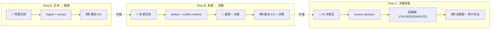

# ch-06 三主轴最小可跑示例

> 9 行跑通三条主用户工作流: 文本建图、多源融合、决策智能。每条主轴配套 cookbook notebook 路径, 可一键拉起。

## 1. 用户视角(User)

### 1.1 我能用它做什么

- 5-9 行 Python 跑通任一主轴。
- 知道每条主轴对应 cookbook 哪个 notebook。
- 知道三主轴之间如何组合 (A → B → C)。

### 1.2 三主轴 5-9 步示例

#### Flow A: 文本 → 实体 → 图谱 → 查询 (cookbook `01_Welcome` → `08_Your_First_Knowledge_Graph`)

```python
from semantica import Semantica
fw = Semantica()
result = fw.build_knowledge_base(
    sources=["./docs/intro.md", "./docs/spec.md"],
    embeddings=True, graph=True,
)
print(result["knowledge_graph"].number_of_nodes(), "nodes")
fw.shutdown()
```

#### Flow B: 多源 → 去重 → 冲突 → 推理 (cookbook `06_Multi_Source_Data_Integration`)

```python
from semantica.deduplication.methods import merge_entities
from semantica.conflicts.methods import detect_conflicts, resolve_conflicts
from semantica.reasoning.methods import run_datalog

entities_a = [{"id": "p1", "name": "Einstein", "type": "PERSON"}]
entities_b = [{"id": "p2", "name": "Albert Einstein", "type": "PERSON"}]

conflicts = detect_conflicts([entities_a, entities_b])
resolved = resolve_conflicts(conflicts, strategy="voting")
merged = merge_entities(resolved)
facts = run_datalog(["person(X) :- name(X, 'Einstein')."])
```

#### Flow C: 决策智能 / 上下文图谱 (cookbook `19_Context_Module`)

```python
from semantica.context.decision_methods import (
    record_decision, add_causal_relationship, find_similar_decisions,
    check_decision_rules, trace_decision_chain,
)

d1 = record_decision(category="credit_approval",
                     scenario="Acme Corp 短期贷款",
                     reasoning="无违约记录",
                     outcome={"approved": True, "amount": 800_000},
                     confidence=0.9,
                     decided_by="analyst@bank.com")

d2 = record_decision(category="credit_approval",
                     scenario="Acme Corp 长期贷款",
                     reasoning="营收稳定增长",
                     outcome={"approved": True, "amount": 1_500_000},
                     confidence=0.85,
                     decided_by="analyst@bank.com")

add_causal_relationship(d1["id"], "enabled", d2["id"])

similar = find_similar_decisions(d2["id"], top_k=3)
chain = trace_decision_chain(d2["id"])
```

> 三主轴 9 行代码对照见 [[ch-40-flow-a-text-to-graph]] / [[ch-41-flow-b-multi-source]] / [[ch-42-flow-c-decision-intel]] 各自 §1.2 完整端到端剧本。

### 1.3 何时用哪条主轴

- 只想从单源文档建图 → A。
- 多源 + 冲突 → B。
- 要给 AI 决策做因果审计 → C。

### 1.4 何时不用

- 单文档 < 1k token → 直接用 LLM + RAG, 不必建图。
- 多源但完全同构 → 用 ETL (Airbyte / dbt) 即可。

## 2. 开发者视角(Developer)

### 2.1 公开 API 速查 (三主轴各取一例)

| 主轴 | facade 函数 | 文件位置 |
|---|---|---|
| A | `Semantica.build_knowledge_base(sources, ...)` | `core/orchestrator.py:281` |
| B | `semantica.deduplication.merge_entities()` `semantica.conflicts.resolve_conflicts()` | `deduplication/methods.py:296`, `conflicts/methods.py:201` |
| C | `context.decision_methods.{record,add_causal,find_similar,trace}` | `context/decision_methods.py:23-878` |

### 2.2 关键代码路径

- A: `semantica/core/orchestrator.py:281 build_knowledge_base` — 编排 ingest→parse→extract→kg→embedding 全流程。
- B: `semantica/deduplication/methods.py:296 merge_entities`, `semantica/conflicts/methods.py:201 resolve_conflicts`。
- C: `semantica/context/decision_methods.py:23 record_decision`, `:87 find_precedents`, `:125 get_causal_chain`, `:218 capture_decision_trace`。

### 2.3 最小复现脚本

```python
# examples/ch-06-flow-A-minimal.py mirror
import os
os.environ.setdefault("SEMANTICA_LOGGING__LEVEL", "ERROR")
from semantica import Semantica

fw = Semantica()
try:
    result = fw.build_knowledge_base(
        sources=["./README.md"],
        embeddings=False, graph=True,
    )
    kg = result["knowledge_graph"]
    print(f"✓ Nodes={kg.number_of_nodes()}  Edges={kg.number_of_edges()}")
finally:
    fw.shutdown()
```

### 2.4 扩展点

- Flow A 想增量更新: 调用 `framework.run_pipeline(custom_pipeline, new_data)`, 不走 `build_knowledge_base`。
- Flow B 想自定义冲突策略: 在 `conflicts/methods.py:resolve_conflicts(strategy="my_strategy")` 注入回调。
- Flow C 想批量记录决策: 循环 `record_decision`, 批内 `add_causal_relationship` 串链。

## 3. 架构师视角(Architect)

### 3.1 三主轴等价于三种数据契约

| 主轴 | 输入契约 | 输出契约 | 关键差异 |
|---|---|---|---|
| A | 单源文档列表 | 静态知识图 | 一次性 ETL 思维 |
| B | 多源文档列表 | 融合 + 去重 + 决策图 | 冲突解决是核心 |
| C | AI 决策流 | 因果审计图 | 决策也是图节点 |

设计含义:
- **A 是"批量"的代表**, 适合 offline ETL; **B 是"流式融合"的代表**, 适合持续集成; **C 是"实时治理"的代表**, 适合 agent 决策点。
- 三者共用 ContextGraph [[ch-55-glossary]] 作为"汇流处", 但写入节奏不同 (A 一次性, B 周期性, C 实时)。

### 3.2 三主轴对照图 (FIG-09)

### 3.3 何时重新组织主轴

- 主轴数 > 3 时, 抽取"主轴 X"的共同骨架作为 `SemanticaBaseFlow`, 让用户继承。
- 用户普遍把 A 当 B 用 (即想做融合但用单源 API) → 在 `build_knowledge_base` 加 `multi_source=True` 自动走 B 路径。

## 本章图表

### FIG-09 三主轴对照图



图说: 三主轴的输入/输出与衔接关系 — A → B → C 是"自然升级路径"。

## 跨章引用

- 上一章: [[ch-05-data-models]]
- Flow A 深度: [[ch-40-flow-a-text-to-graph]]
- Flow B 深度: [[ch-41-flow-b-multi-source]]
- Flow C 深度: [[ch-42-flow-c-decision-intel]]
- 安装: [[ch-03-install]]