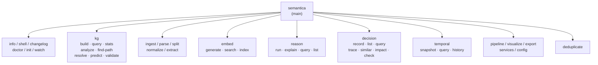

# ch-27 CLI 全解 — Click + Rich 的 80+ 子命令

> Semantica 把每个 `core/methods.py` 的 wrapper 都暴露成一个 CLI 子命令。本章讲解命令树、参数体系、与框架 facade 的关系。

## 1. 用户视角(User)

### 1.1 我能用它做什么

- 80+ 子命令, 覆盖 ingest / parse / extract / embed / kg / reason / decision / pipeline / temporal / visualize / export / services / config / doctor。
- 顶层全局选项: `--config / --log-level / --json / --quiet / --no-color / --dry-run / --store / --vector-store / --profile`。
- 与 `~/.semantica/config.yaml` 自动联动 (`semantica --config path.yaml kg build ...`)。

### 1.2 一段最小可跑示例

```bash
# 自检
semantica doctor

# 启动交互 shell (Rich REPL)
semantica shell

# 看 changelog (JSON 输出给 CI)
semantica changelog --json | jq '.[0].version'

# 从 PDF 建图
semantica kg build --sources ./intro.pdf --temporal --embeddings

# 决策查询 (输出 mermaid)
semantica decision trace <dec-id> --format mermaid

# 启动 server
semantica-server                # 默认 0.0.0.0:8000
semantica-explorer              # Explorer UI
semantica-worker                # 异步 worker
semantica-mcp                   # stdio MCP server
```

### 1.3 何时不用

- 想用 Python 而非 shell → 直接 `from semantica import Semantica`。
- 想远程调用 → 用 REST API ([ch-28-server-api])。

## 2. 开发者视角(Developer)

### 2.1 公开 API

```python
# 命令分组
semantica.cli.main               # @click.group, cli.py:493
semantica.cli.kg                 # @main.group, cli.py:580
semantica.cli.embed              # embed  group, cli.py:1661
semantica.cli.reason             # reason group, cli.py:1947
semantica.cli.decision           # decision group, cli.py:2089
semantica.cli.temporal           # temporal group, cli.py:2341
semantica.cli.pipeline           # pipeline group, cli.py:589
semantica.cli.services           # services group, cli.py:596
semantica.cli.config             # config group, cli.py:611

# 子命令
semantica.cli.doctor             # 776
semantica.cli.shell              # 654
semantica.cli.changelog          # 721
semantica.cli.info               # 619
semantica.cli.init               # 883
semantica.cli.watch              # 951 (需 watchdog extras)

# kg 子命令
semantica.cli.kg.build           # 1041
semantica.cli.kg.query           # 1172 (cypher/sparql)
semantica.cli.kg.stats           # 1197
semantica.cli.kg.analyze         # 1230
semantica.cli.kg.find_path       # 1257
semantica.cli.kg.resolve         # 1282
semantica.cli.kg.predict         # 1303
semantica.cli.kg.validate        # 1324
```

### 2.2 关键代码路径

- `semantica/cli.py:493` — `@click.group(main)` 顶层。
- `semantica/cli.py:580` — `@main.group(kg)`。
- `semantica/cli.py:1661` — `@main.group(embed)`。
- `semantica/cli.py:1947` — `@main.group(reason)`。
- `semantica/cli.py:2089` — `@main.group(decision)`。
- `semantica/cli.py:2341` — `@main.group(temporal)`。
- `semantica/cli.py:589` — `@main.group(pipeline)`。
- `semantica/cli.py:596` — `@main.group(services)`。
- `semantica/cli.py:611` — `@main.group(config)`。
- `semantica/cli.py:619-721` — `info / shell / changelog`。
- `semantica/cli.py:776` — `doctor` (Rich 输出)。
- `semantica/cli.py:883` — `init` (生成 `~/.semantica/config.yaml`)。
- `semantica/cli.py:951` — `watch` (watchdog 监听)。
- `semantica/cli.py:1041-1324` — `kg.*` 8 个子命令。
- `semantica/cli.py:1681-1771` — `embed.*` 3 个子命令。
- `semantica/cli.py:1963-2067` — `reason.*` 4 个子命令。
- `semantica/cli.py:2105-2316` — `decision.*` 7 个子命令。
- `semantica/cli.py:2354-2407` — `temporal.*` 3 个子命令。

### 2.3 最小复现脚本

```bash
# 启动 framework 并通过 cli 调用
semantica info 2>&1 | grep "Semantica Framework"
semantica doctor 2>&1 | grep -E "✓|✗" | head -10
```

### 2.4 扩展点

- **加新子命令**: 在 `cli.py` 加 `@main.command()` 函数, 调用对应的 `core/methods.py` wrapper。
- **加新命令组**: 在 `cli.py:_register_groups` 加 `@main.group()`。
- **加全局选项**: 在 `main()` 函数加 `@click.option(...)`。

## 3. 架构师视角(Architect)

### 3.1 设计取舍

**为什么用 Click + Rich, 而不是 Typer / argparse?**
- Click 是 Python CLI 事实标准, 装饰器风格清晰。
- Rich 给所有输出加表格 / 颜色 / 进度条, 体验远胜裸 print。
- Typer 是 Click 之上的 type-hint 包装, 但增加一层间接, Semantica 选直接 Click + Rich。

**为什么 CLI 调用 framework 初始化而不是每个子命令独立 init?**
- CLIContext (cli.py:558) 缓存 config + 启动一次 logging, 避免每个子命令重复初始化 (~100ms 节省)。
- `--json` / `--quiet` / `--no-color` 等全局选项只解析一次。

### 3.2 与同类对比

| 维度 | Semantica CLI | LangChain CLI | LlamaIndex CLI |
|---|---|---|---|
| 子命令数 | 80+ | 5 | 3 |
| Rich 美化 | ✅ | ❌ | ❌ |
| 全局配置 | ✅ | ⚠ env only | ⚠ env only |

### 3.3 何时重新设计

- 子命令数 > 150 → 拆 `cli-root` / `cli-kg` / `cli-decision` 子包。
- 出现"远端 CLI" (通过 SSH 在远端跑) → 引入 `cli-remote` 走 REST。

## 本章图表

### FIG-14 CLI 命令树



图说: 顶层 `main` 9 大分支; 实际 80+ 子命令分布在各分支下。

## 跨章引用

- 上一章: [[ch-26-visualization-export]]
- Server: [[ch-28-server-api]]
- Worker: [[ch-29-worker]]
- MCP: [[ch-30-mcp-server]]