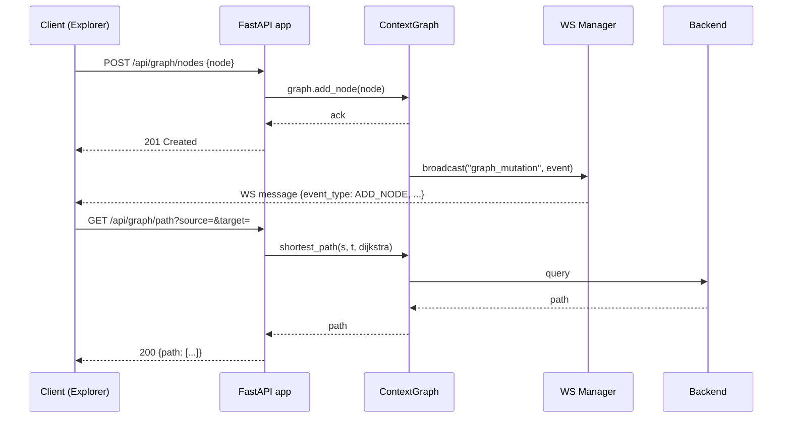

# ch-28 Server API — REST + WebSocket

> FastAPI 暴露的 ~100 个 REST 端点 + 单 WebSocket。本章讲解 11 大路由域 + 时序图。

## 1. 用户视角(User)

### 1.1 我能用它做什么

- REST API: ~100 端点, 分 11 域 (graph / ontology / decisions / temporal / vocabulary / sparql / provenance / export-import / enrich / annotations / analytics)。
- WebSocket `/ws/graph-updates`: 实时推送 `graph_mutation` 事件。
- 启动方式: `semantica-server` 或 `uvicorn semantica.explorer.app:app --reload`。

### 1.2 一段最小可跑示例

```bash
# 健康检查
curl http://localhost:8000/health

# 图节点
curl http://localhost:8000/api/graph/nodes?limit=10

# 语义检索
curl -X POST http://localhost:8000/api/graph/search \
     -H "Content-Type: application/json" \
     -d '{"query": "Einstein", "top_k": 5}'

# 路径
curl 'http://localhost:8000/api/graph/path?source=e1&target=e2&algorithm=dijkstra'

# Provenance
curl 'http://localhost:8000/api/provenance/report?node_id=e1&format=json' -o prov.json
```

WebSocket (浏览器 JS):

```js
const ws = new WebSocket("ws://localhost:8000/ws/graph-updates");
ws.onmessage = (ev) => {
    const msg = JSON.parse(ev.data);
    if (msg.event_type === "graph_mutation") console.log("mutation:", msg);
};
```

### 1.3 何时不用

- 单机 + Python → 直接调 SDK ([ch-12-semantic-extract] 等), 比 HTTP 更快。
- 你需要 OAuth2 / 复杂鉴权 → 在前置网关 (Kong / Nginx) 加, 而非 Semantica 自带。

## 2. 开发者视角(Developer)

### 2.1 公开路由表

| 路径前缀 | 文件 | 行数 | 端点数 |
|---|---|---|---|
| `/api/graph` | `explorer/routes/graph.py` | 655 | ~15 |
| `/api/ontology` | `explorer/routes/ontology.py` | 3400 | ~40 |
| `/api/decisions` | `explorer/routes/decisions.py` | 167 | 6 |
| `/api/analytics` | `explorer/routes/analytics.py` | 112 | 2 |
| `/api/temporal` | `explorer/routes/temporal.py` | 247 | 5 |
| `/api/vocabulary` | `explorer/routes/vocabulary.py` | 240 | 4 |
| `/api/sparql` | `explorer/routes/sparql.py` | 192 | 1 |
| `/api/provenance` | `explorer/routes/provenance.py` | 344 | 3 |
| `/api/export_import` | `explorer/routes/export_import.py` | 297 | 3 |
| `/api/enrich` | `explorer/routes/enrich.py` | 359 | 5 |
| `/api/annotations` | `explorer/routes/annotations.py` | 65 | 4 |

### 2.2 关键代码路径

- `semantica/server.py:63` — `app = FastAPI(...)` 顶层。
- `semantica/server.py:122` — `GET /api/info`。
- `semantica/server.py:131` — `GET /health`。
- `semantica/server.py:137` — `POST /build` (stub)。
- `semantica/server.py:162-172` — 挂载 10 个 explorer router。
- `semantica/server.py:184` — SPA catch-all `/{full_path:path}`。
- `semantica/explorer/app.py:82` — `create_app(session, provenance_storage_path)` factory。
- `semantica/explorer/app.py:55` — `_install_mutation_bridge` (ContextGraph [[ch-55-glossary]] mutation → WS broadcast)。
- `semantica/explorer/app.py:177` — `WebSocket /ws/graph-updates` (64 KB 消息上限)。
- `semantica/explorer/ws.py:91` — `ConnectionManager`。
- `semantica/explorer/routes/graph.py:655` — `graph.py` 主体。
- `semantica/explorer/routes/graph.py:388` — `find_path`。
- `semantica/explorer/routes/graph.py:417` — `search_nodes`。
- `semantica/explorer/routes/graph.py:471` — `distance_matrix`。
- `semantica/explorer/routes/graph.py:552/635` — `semantic_neighborhood`。
- `semantica/explorer/routes/graph.py:651` — `graph_stats`。
- `semantica/explorer/routes/ontology.py:3400` — ontology 全套。

### 2.3 最小复现脚本

```python
# examples/ch-28-server-ping.py mirror
import httpx

r = httpx.get("http://localhost:8000/health")
print(r.status_code, r.json())

r = httpx.get("http://localhost:8000/api/graph/stats")
print(r.json())
```

### 2.4 扩展点

- **加新路由**: 在 `explorer/routes/` 加文件, 在 `app.py:create_app` 注册。
- **加新 WS 事件**: 在 `_install_mutation_bridge` 加 broadcast 频道。
- **加 OAuth2**: 在 `app.py` 注入 `OAuth2PasswordBearer`。

## 3. 架构师视角(Architect)

### 3.1 设计取舍

**为什么 server.py 是 243 行的"空壳", 而 explorer/app.py 是真正的应用?**
- 早期 server.py 是 CLI 之外的另一入口, 后来 Explorer 接管全部 UI/API, server.py 退化。
- 保留 server.py 是为了"启动最小服务"(无 Explorer)的场景, 如嵌入式部署。

**为什么 mutation bridge 而非轮询?**
- ContextGraph 任何节点/边变更立刻广播, Explorer 实时刷新。
- 避免客户端轮询浪费 90% 请求。
- 代价: WS 断线需重连, 后端需 heartbeat。

### 3.2 与同类对比

| 维度 | Semantica Server | LangServe | LlamaIndex QueryAPI |
|---|---|---|---|
| 端点数 | ~100 | ~5 | ~10 |
| WebSocket | ✅ | ❌ | ❌ |
| CORS / Security headers | ✅ | ⚠ 弱 | ⚠ 弱 |

### 3.3 何时重新设计

- 端点数 > 200 → 拆 `api-public` / `api-internal`。
- 出现"高 QPS 写" → 引入消息队列 (Kafka/Pulsar) 异步写。

## 本章图表

### FIG-05 REST + WS 时序图



图说: 写操作触发 mutation 广播, 读操作直接查询; WS 与 REST 并行。

## 跨章引用

- 上一章: [[ch-27-cli]]
- 下一章: [[ch-29-worker]]
- Explorer 前端: [[ch-31-explorer-frontend]]
- MCP: [[ch-30-mcp-server]]