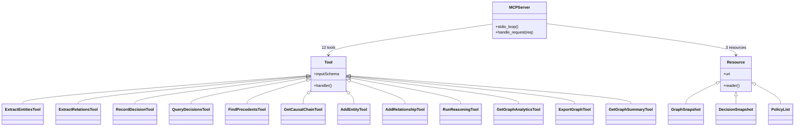

# ch-30 MCP Server — 12 tools + 3 resources

> 通过 Model Context Protocol 把 Semantica 暴露给 LLM / IDE / Claude Desktop。本章讲解 stdio 协议 + 工具清单 + 在 Claude/IDE 中配置。

## 1. 用户视角(User)

### 1.1 我能用它做什么

- 在 Claude Desktop / Claude Code / Cursor / Continue 中直接"对话式"调用 Semantica。
- 12 个 tool: extract_entities / extract_relations / record_decision / query_decisions / find_precedents / get_causal_chain / add_entity / add_relationship / run_reasoning / get_graph_analytics / export_graph / get_graph_summary。
- 3 个 resource: 知识图快照 / 决策图快照 / 策略清单。

### 1.2 一段最小可跑示例

启动:

```bash
semantica-mcp                    # stdio 模式, 默认
python -m semantica.mcp_server   # 等价
```

在 Claude Desktop (`~/Library/Application Support/Claude/claude_desktop_config.json`) 加:

```json
{
  "mcpServers": {
    "semantica": {
      "command": "semantica-mcp",
      "args": [],
      "env": {"SEMANTICA_LOGGING__LEVEL": "INFO"}
    }
  }
}
```

重启 Claude Desktop, 在对话里输入:

> "调用 semantica 的 record_decision, 记录一笔贷款审批: ..."

Claude 会通过 MCP 调用 Semantica, 返回决策 ID + 因果链。

### 1.3 何时不用

- 你不需要 LLM 调用 → 用 REST API ([ch-28-server-api])。
- 你需要双向流式 → 用 WebSocket, MCP 是请求/响应。

## 2. 开发者视角(Developer)

### 2.1 公开工具清单

| Tool | 输入 | 输出 |
|---|---|---|
| `extract_entities` | `{text, provider, model}` | `entities[]` |
| `extract_relations` | `{text, entities, provider, model}` | `relations[]` |
| `record_decision` | `{category, scenario, reasoning, outcome, confidence, decided_by}` | `{id, ...}` |
| `query_decisions` | `{filter}` | `decisions[]` |
| `find_precedents` | `{decision_id, top_k}` | `similar_decisions[]` |
| `get_causal_chain` | `{decision_id}` | `chain[]` |
| `add_entity` | `{name, type, properties}` | `{id, ...}` |
| `add_relationship` | `{source_id, target_id, type}` | `{id, ...}` |
| `run_reasoning` | `{rules, facts}` | `derived[]` |
| `get_graph_analytics` | `{algorithm}` | `result` |
| `export_graph` | `{format}` | `{path}` |
| `get_graph_summary` | `{}` | `{nodes, edges, ...}` |

### 2.2 关键代码路径

- `semantica/mcp_server/__init__.py:288` — `TOOLS` 列表 12 个 tool 定义。
- `semantica/mcp_server/__init__.py:79-275` — 12 个 `_tool_*` handler 函数 (例如 `_tool_extract_entities`)。
- `semantica/mcp_server/__init__.py:472` — `_read_resource` 3 个 resource。
- `semantica/mcp_server/__init__.py:502` — `_handle` 协议分发。
- `semantica/mcp_server/__init__.py:571` — `_run_stdio` 主循环。
- `semantica/mcp_server/__init__.py:608` — `main()` 入口。
- `semantica/mcp_server/__main__.py` — `python -m semantica.mcp_server` 入口。
- `pyproject.toml:entry-points` — `semantica-mcp = "semantica.mcp_server:main"`。

### 2.3 最小复现脚本

```python
# examples/ch-30-mcp-smoke.py mirror
from semantica.mcp_server import TOOLS

print(f"Total MCP tools: {len(TOOLS)}")
for t in TOOLS:
    print(f"- {t['name']:25s} {t['description'][:60]}")
```

### 2.4 扩展点

- **加新 tool**: 在 `TOOLS` 列表追加 `{name, description, inputSchema, _handler}`。
- **加新 resource**: 在 `_read_resource` 加分支。
- **改传输**: 改 `_run_stdio` 为 SSE / WebSocket。

## 3. 架构师视角(Architect)

### 3.1 设计取舍

**为什么 stdio 而非 HTTP / SSE?**
- MCP 标准默认 stdio (Claude Desktop 早期要求)。
- stdio 进程模型简单, 启动快, 适合 IDE/Claude 这种"启动即用"场景。
- 代价: 跨网络 / 跨进程需要 socat / SSH 隧道, 不如 HTTP 直白。

**为什么 12 个 tool, 而不是更多?**
- LLM 的 function-call 注意力有限, 12 是经验上限。
- 多余能力通过组合现有 tool 实现, 例如"先 add_entity 再 add_relationship"。

### 3.2 与同类对比

| 维度 | Semantica MCP | LangChain MCP | OpenAI Function Calling |
|---|---|---|---|
| 工具数 | 12 | 10+ | 用户自定义 |
| 协议 | stdio MCP | stdio MCP | HTTP function |
| Resource | ✅ | ❌ | N/A |

### 3.3 何时重新设计

- 工具数 > 30 → 拆 `mcp_decision` / `mcp_kg` 多个 server, 用户按需启用。
- 出现"实时流"需求 → 切 SSE transport。

## 本章图表

### FIG-15 MCP tools + resources



图说: MCP server 注册 12 tool + 3 resource, stdio loop 持续监听 LLM 请求。

## 跨章引用

- 上一章: [[ch-29-worker]]
- 下一章: [[ch-31-explorer-frontend]]
- Agent 集成: [[ch-38-agent-frameworks]]