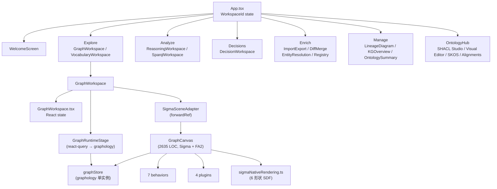

# ch-31 Explorer Frontend — React 19 + Sigma.js 工作台

> Knowledge Explorer 是 Semantica 自带的可视化 IDE。本章讲解 7 个 workspace + Sigma/graphology [[ch-55-glossary]] 状态架构 + WebSocket 实时同步。

## 1. 用户视角(User)

### 1.1 我能用它做什么

- 7 个 workspace: Welcome / Explore (Graph + Vocabulary) / Analyze (Reasoning + SPARQL) / Decisions / Enrich (4 tabs) / Manage (3 tabs) / Ontology Hub (SHACL/SKOS/alignments)。
- 启动: `semantica-explorer` (默认 8000 端口) 或访问 `http://localhost:8000/` (server 模式)。
- 实时同步: 任何 API 写入立刻反映在画布上 (WebSocket 推送)。

### 1.2 一段最小可跑示例

启动 Explorer:

```bash
# 1) 启动 backend (默认 8000)
semantica-server &

# 2) 启动 Explorer UI (默认 8000, 与 server 同端口)
semantica-explorer &

# 3) 浏览器打开 http://localhost:8000/
```

界面速览:
- **左侧 Rail**: 6 个导航按钮 (Database / FileSearch / Scale / GitBranchPlus / Settings2 / GitMerge)。
- **顶部 Header**: kicker / title / subtitle / 标签切换。
- **中央 Workspace**: Sigma.js 图画布 / 列表 / 表单 / Monaco 编辑器。
- **右侧 Inspector**: 节点属性 / 操作按钮 / Trace Path / Candidate Links / Source Attribution。

### 1.3 何时不用

- 你只要命令行 → 用 [ch-27-cli] / REST API。
- 你要自定义 UI → fork Explorer, 调 `SigmaSceneAdapter` 接口换渲染器。

## 2. 开发者视角(Developer)

### 2.1 技术栈速查

```json
{
  "react": "^19.2.4",
  "vite": "^6.4.2",
  "sigma": "^3.0.2",
  "graphology": "^0.26.0",
  "@tanstack/react-query": "^5.95.2",
  "@xyflow/react": "^12.10.2",
  "vis-timeline": "^8.5.0",
  "@monaco-editor/react": "^4.7.0"
}
```

### 2.2 关键代码路径

- `explorer/src/App.tsx:35-86` — 7 个 workspace 状态机。
- `explorer/src/workspaces/GraphWorkspace/GraphCanvas.tsx:1-177` — Sigma 设置。
- `explorer/src/workspaces/GraphWorkspace/GraphCanvas.tsx:2635` — Sigma 实例 + FA2 + behaviors。
- `explorer/src/workspaces/GraphWorkspace/GraphWorkspace.tsx:3194` — 顶层 React 状态。
- `explorer/src/workspaces/GraphWorkspace/GraphRuntimeStage.tsx:479` — react-query → graphology 桥。
- `explorer/src/workspaces/GraphWorkspace/SigmaSceneAdapter.tsx:55` — `forwardRef` 适配器。
- `explorer/src/workspaces/GraphWorkspace/sigmaNativeRendering.ts:316` — `drawSemanticaNodeLabel` 自定义 WebGL label。
- `explorer/src/workspaces/GraphWorkspace/sigmaNativeRendering.ts:358` — `drawSemanticaNodeHover` 自定义 WebGL hover。
- `explorer/src/workspaces/GraphWorkspace/graphSceneState.ts:2725` — displayGraph reducer。
- `explorer/src/workspaces/GraphWorkspace/graphSceneLayers.ts` — contour / lens / path / temporal layers。
- `explorer/src/workspaces/GraphWorkspace/graphTheme.ts:1078` — 设计令牌。
- `explorer/src/workspaces/GraphWorkspace/graphEntityShape.ts` — 6 种实体形状 SDF。
- `explorer/src/workspaces/GraphWorkspace/behaviors/*` — 7 个交互行为模块。
- `explorer/src/workspaces/GraphWorkspace/plugins/*` — 插件 (legend / neighborhood / temporal / exploration)。
- `explorer/src/store/graphStore.ts` — `graphology` 单实例。
- `explorer/src/store/registryStore.ts` — pub/sub 审计日志。
- `explorer/src/ErrorBoundary.tsx` — 3 重试预算。
- `explorer/src/ui/primitives.tsx` — 设计系统原语 (WorkspaceFrame / SurfaceCard / MetricChip)。
- `explorer/src/ui/primitives.css` — `.sem-*` 类。

### 2.3 最小复现脚本

```bash
# 单元测试 (3 个 node --test 文件)
cd /Users/digoal/new/semantica/explorer
npm run test:graph-store
npm run test:graph-workspace
npm run test:plugin-registry
```

### 2.4 扩展点

- **加新 workspace**: 在 `App.tsx:WorkspaceId` 加枚举值, 加 lazy chunk。
- **加新行为**: 在 `GraphWorkspace/behaviors/` 加 `xxxBehavior.ts`, 注册到 `GraphCanvas`。
- **换渲染器**: 实现 `scene.ts:GraphSceneAdapter` 接口, 替换 `SigmaSceneAdapter`。
- **加新 WebGL 程序**: 在 `sigmaNativeRendering.ts` 加 `extends NodeProgram`。

## 3. 架构师视角(Architect)

### 3.1 设计取舍

**为什么用 Sigma + graphology 而不是 Cytoscape / d3?**
- Sigma 走 WebGL 渲染, 节点 > 10k 仍能流畅 (60fps)。
- graphology 提供图论算法 (BFS / community / shortest path) 客户端即可跑, 不必来回 round-trip。
- d3 灵活但慢, Cytoscape 功能强但臃肿, Sigma 是中间路线。

**为什么 graphology 单实例?**
- 整个客户端唯一权威数据源, 避免多副本同步噩梦。
- Sigma 订阅 attribute changes 自动重绘, 与 react-query 解耦。
- 代价: 内存占用大 (1M 节点 ≈ 1 GB), 大图需分片加载。

**为什么 WorkspaceShell 是 state-driven 而非路由?**
- 避免 react-router 依赖, 减少 30+ KB bundle。
- 适合"单一 SPA + 多 tab"场景, 不适合"深链接 + 浏览器后退"。
- 如需深链, 可加 `react-router` 同步 `activeWorkspace`。

### 3.2 与同类对比

| 维度 | Semantica Explorer | Neo4j Browser | Metaphactory |
|---|---|---|---|
| 渲染 | Sigma WebGL | Neo4j 自有 | Cytoscape |
| Workspace 数 | 7 | 3 | 4 |
| 测试 | 3 node:test | E2E 完整 | E2E |

### 3.3 何时重新设计

- 节点 > 100k → 引入分片 / 虚拟化。
- 出现"多人协作" → 引入 CRDT (Yjs / Automerge) 同步 graphology。

## 本章图表

### FIG-06 Explorer 组件树



图说: 7 个 workspace 共享 graphStore 单实例, GraphCanvas 是最大的渲染节点。

## 跨章引用

- 上一章: [[ch-30-mcp-server]]
- 下一章: [[ch-32-lifecycle-errors-config]]
- 服务端 API: [[ch-28-server-api]]
- 自定义开发: [[ch-04-architecture-30kft]] § 3.3