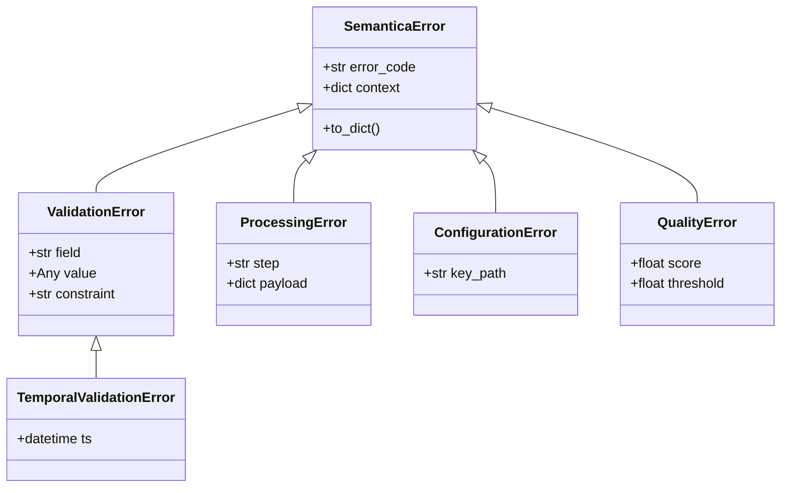
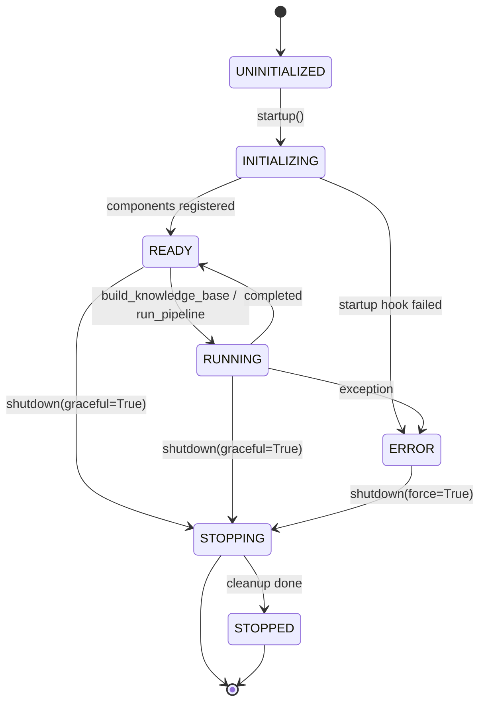

# ch-32 生命周期 / 异常体系 / 配置深探

> 三大横切面: 生命周期状态机 (`LifecycleManager`)、异常层级 (`SemanticaError` 五子类)、配置 deep-merge 与校验。

## 1. 用户视角(User)

### 1.1 我能用它做什么

- 查询 framework 状态: `fw.lifecycle_manager.get_state()` → `READY` / `RUNNING` / `ERROR`。
- 健康检查: `fw.get_status() -> {state, health, modules, plugins, config}`。
- 优雅关闭: `fw.shutdown(graceful=True)`。
- 错误捕获: 5 类异常细分 (Validation / Processing / Configuration / Quality / TemporalValidation)。
- 配置深探: 嵌套路径 `fw.config.get("processing.batch_size")`。

### 1.2 一段最小可跑示例

```python
from semantica import Semantica
from semantica.utils.exceptions import ValidationError, ConfigurationError [[ch-55-glossary]]

fw = Semantica()
try:
    fw.initialize()
    status = fw.get_status()
    print("State:", status["state"])
    print("Modules:", list(status["modules"].keys()))
finally:
    fw.shutdown(graceful=True)

# 配置嵌套访问
print(fw.config.get("knowledge_graph.backend"))  # "networkx"

# 配置校验会失败的样例
try:
    Semantica({"processing": {"batch_size": -1}})
except ConfigurationError as e:
    print(f"Caught: {e}")
```

### 1.3 何时不用

- 单脚本 → 直接 `Semantica(...)` 用完即弃, 不必关心生命周期。
- 你已有自己的 lifecycle (FastAPI lifespan) → 不必用 `LifecycleManager`。

## 2. 开发者视角(Developer)

### 2.1 公开 API

```python
semantica.core.Semantica(config_dict=None, **kwargs)
semantica.core.Semantica.initialize()
semantica.core.Semantica.shutdown(graceful=True)
semantica.core.Semantica.get_status()
semantica.core.LifecycleManager()
semantica.core.LifecycleManager.register_component(name, component)
semantica.core.LifecycleManager.register_startup_hook(priority, hook)
semantica.core.LifecycleManager.register_shutdown_hook(priority, hook)
semantica.core.LifecycleManager.startup()
semantica.core.LifecycleManager.shutdown(graceful)
semantica.core.LifecycleManager.health_check()
semantica.core.LifecycleManager.get_health_summary()
semantica.core.LifecycleManager.get_state()
semantica.core.Config()
semantica.core.ConfigManager()
semantica.core.ConfigManager.load_from_file(path)
semantica.core.ConfigManager.load_from_dict(d)
semantica.core.ConfigManager.merge_configs(cfgs)
semantica.utils.exceptions.SemanticaError
semantica.utils.exceptions.ValidationError
semantica.utils.exceptions.ProcessingError
semantica.utils.exceptions.ConfigurationError
semantica.utils.exceptions.QualityError
semantica.utils.exceptions.TemporalValidationError
semantica.utils.exceptions.handle_exception(e, context)
semantica.utils.exceptions.format_exception(e, **opts)
```

### 2.2 关键代码路径

- `semantica/core/lifecycle.py:36` — `SystemState` 枚举。
- `semantica/core/lifecycle.py:49` — `HealthStatus` dataclass。
- `semantica/core/lifecycle.py:59` — `LifecycleManager`。
- `semantica/core/lifecycle.py:111` — `startup()`。
- `semantica/core/lifecycle.py:204` — `shutdown(graceful=True)`。
- `semantica/core/lifecycle.py:317` — `health_check()`。
- `semantica/core/lifecycle.py:441` — `register_component`。
- `semantica/core/lifecycle.py:465` — `register_startup_hook`。
- `semantica/core/lifecycle.py:484` — `register_shutdown_hook`。
- `semantica/core/lifecycle.py:530` — `get_health_summary()`。
- `semantica/core/config_manager.py:60` — `_load_from_env`。
- `semantica/core/config_manager.py:89` — `Config.__init__`。
- `semantica/core/config_manager.py:134` — `_initialize_sections`。
- `semantica/core/config_manager.py:236` — `Config.validate()`。
- `semantica/core/config_manager.py:331` — `Config.to_dict()`。
- `semantica/core/config_manager.py:352` — `Config.get(key_path)`。
- `semantica/core/config_manager.py:366` — `Config.set(...)`。
- `semantica/utils/exceptions.py:49` — `SemanticaError` 基类。
- `semantica/utils/exceptions.py:122` — `ValidationError`。
- `semantica/utils/exceptions.py:155` — `TemporalValidationError`。
- `semantica/utils/exceptions.py:182` — `ProcessingError`。
- `semantica/utils/exceptions.py:215` — `ConfigurationError`。
- `semantica/utils/exceptions.py:248` — `QualityError`。
- `semantica/utils/exceptions.py:281` — `handle_exception(e, context)`。
- `semantica/utils/exceptions.py:346` — `format_exception(e, **opts)`。

### 2.3 最小复现脚本

```python
# examples/ch-32-lifecycle-deep.py mirror
from semantica.core import Semantica, LifecycleManager
from semantica.utils.exceptions import ConfigurationError, ProcessingError

# 1) 显式管理 lifecycle
fw = Semantica()
print("Before init:", fw.lifecycle_manager.get_state())  # UNINITIALIZED
fw.initialize()
print("After init:", fw.lifecycle_manager.get_state())   # READY

# 2) 触发错误并捕获
try:
    Semantica({"processing": {"batch_size": -1}})
except ConfigurationError as e:
    print("caught:", e.error_code, e.context)

# 3) 优雅关闭
fw.shutdown(graceful=True)
print("After shutdown:", fw.lifecycle_manager.get_state())  # STOPPED
```

### 2.4 扩展点

- **加新组件**: 在 `Semantica.__init__` 的 `register_component` 加项。
- **加新启动钩子**: 用 `lifecycle_manager.register_startup_hook(priority, fn)`。
- **加新异常子类**: 继承 `SemanticaError`, 设置 `error_code = "SEM00X"`, 在 utils/exceptions.py 文档化。
- **加新配置 section**: 在 `_initialize_sections` 加属性 + DEFAULT_CONFIG 默认值。

## 3. 架构师视角(Architect)

### 3.1 设计取舍

**为什么 lifecycle 是显式状态机而非回调链?**
- 显式状态 (`UNINITIALIZED / INITIALIZING / READY / ...`) 让健康检查可信 (你问 "状态是什么", 它给你精确答案)。
- 回调链虽然灵活, 但难以回答"现在处于哪个阶段"。
- 代价: 增加 613 行代码 + 状态枚举维护成本。

**为什么 5 个异常子类而非通用 `Exception`?**
- 让用户能 `except ValidationError` 精细处理输入错误, 而不必 `except Exception` 吞所有。
- 每类带 `error_code` (SEM001 / SEM001T / SEM002 / SEM003 / SEM004) 便于日志聚合。
- 5 个是经验平衡 (再多用户记不住, 再少细分不够)。

**为什么配置 deep-merge 而非覆盖?**
- 用户在 YAML 里写 `embedding: {provider: openai}`, kwargs 里写 `embedding: {model: text-embedding-3-large}`, 期望两者合并, 而不是后者整段替换 `embedding`。
- deep-merge 让"局部 override"成为可能。
- 代价: 用户需理解"嵌套层级 = 合并粒度"。

### 3.2 与同类对比

| 维度 | Semantica lifecycle | FastAPI lifespan | Spring Lifecycle |
|---|---|---|---|
| 状态枚举 | 7 (UNINITIALIZED → STOPPED) | 2 (startup/shutdown) | 5 |
| 健康检查 | ✅ 内置 | ⚠ 第三方 | ✅ Actuator |
| 钩子优先级 | ✅ | ❌ | ✅ |

| 维度 | Semantica 异常体系 | Python stdlib | Pydantic ValidationError |
|---|---|---|---|
| 错误码 | ✅ SEM001-005 | ❌ | ❌ |
| 上下文 | ✅ `context` dict | ❌ | ⚠ 弱 |

### 3.3 何时重新设计

- 状态数 > 10 → 引入嵌套状态机 (FSM library: transitions)。
- 异常类型 > 20 → 引入"异常族"概念 (exception family)。

## 本章图表

### FIG-11 配置 deep-merge 规则

(同 [[ch-07-configuration-primer]] § 本章图, 此处不重复)

### FIG-12 异常类层级



图说: SemanticaError 是基类, 5 个子类覆盖验证 / 处理 / 配置 / 质量 / 时态验证 5 类失败。

### FIG-13 生命周期状态机



图说: 7 状态迁移, 错误态可由 graceful shutdown 转入 STOPPING。

## 跨章引用

- 上一章: [[ch-31-explorer-frontend]]
- 上一章 (Part II 末): [[ch-26-visualization-export]]
- 部署: [[ch-43-docker-compose]] / [[ch-44-k8s-helm]]
- 错误排查: [[ch-53-troubleshooting]]