# ch-33 LLM Providers 适配矩阵 — 8 家

> Semantica 通过统一 facade 支持 8 家 LLM provider, 含本地 (Ollama / HuggingFace) 与托管 (OpenAI / Anthropic / Gemini / Groq / Mistral / Cohere / Azure / Bedrock / DeepSeek / Llama)。

## 1. 用户视角(User)

### 1.1 我能用它做什么

- 一行切换 LLM provider: `provider="openai"` / `"anthropic"` / `"ollama"` / ...
- 模型自动协商 (provider 路由表)。
- 结构化输出 (Instructor) 一等支持。

### 1.2 适配矩阵

| Provider | extras | 模型示例 | 适用场景 |
|---|---|---|---|
| **OpenAI** | `llm-openai` | gpt-4o / gpt-4o-mini / o1 | 通用高准确 |
| **Anthropic** | `llm-anthropic` | claude-3.5-sonnet / claude-3.5-haiku | 长上下文 (200K) |
| **Gemini** | `llm-gemini` | gemini-1.5-pro / gemini-1.5-flash | 多模态 |
| **Groq** | `llm-groq` | llama-3.1-70b (Groq LPU) | 低延迟 |
| **Mistral** | `llm-mistral` | mistral-large / codestral | 欧洲合规 |
| **Cohere** | `llm-cohere` | command-r-plus | RAG 优化 |
| **Azure OpenAI** | `llm-azure` | gpt-4 (Azure) | 企业合规 |
| **Bedrock** | `llm-bedrock` | claude / llama / titan on Bedrock | AWS 一体 |
| **Ollama** | `llm-ollama` | llama3.1 / mistral / qwen | 本地 / 离线 |
| **HuggingFace** | `llm-huggingface` | 100k+ 模型 | 自托管 |
| **DeepSeek** | `llm-deepseek` | deepseek-chat / coder | 中文 / 代码 |
| **Llama** | `llm-llama` | llama-3.1-405b (托管) | Meta 直连 |
| **LiteLLM** | `llm-litellm` | 100+ 模型 (统一门面) | 多 provider 一键切 |
| **Instructor** | `llm-instructor` | (基于以上) | 结构化输出 |

> 单一 extras 安装: `pip install "semantica[llm-openai]"`, 或全装: `pip install "semantica[llm-all]"`。

### 1.3 一段最小可跑示例

```python
from semantica.semantic_extract.methods import extract_entities_llm

text = "Einstein discovered relativity in 1905."

# OpenAI
ents = extract_entities_llm(text, provider="openai", model="gpt-4o-mini")

# Anthropic
ents = extract_entities_llm(text, provider="anthropic", model="claude-3-5-haiku-20241022")

# Ollama (本地)
ents = extract_entities_llm(text, provider="ollama", model="llama3.1")
```

### 1.4 何时不用

- 你的 provider 不在矩阵 → 自己实现 `BaseProvider`。
- 你要"模型路由 + 成本优化" → 引入 LiteLLM (`llm-litellm` extras) 或 Portkey。

## 2. 开发者视角(Developer)

### 2.1 公开 API

```python
semantica.llms.OpenAI()
semantica.llms.Anthropic()
semantica.llms.Gemini()
semantica.llms.Groq()
semantica.llms.Mistral()
semantica.llms.Cohere()
semantica.llms.AzureOpenAI()
semantica.llms.Bedrock()
semantica.llms.Ollama()
semantica.llms.HuggingFaceLLM()
semantica.llms.DeepSeek()
semantica.llms.Llama()
semantica.llms.LiteLLM()
semantica.llms.InstructorWrapper()
semantica.semantic_extract.providers.BaseProvider
semantica.semantic_extract.providers.OpenAIProvider
semantica.semantic_extract.providers.AnthropicProvider
semantica.semantic_extract.providers.GeminiProvider
semantica.semantic_extract.providers.GroqProvider
semantica.semantic_extract.providers.OllamaProvider
```

### 2.2 关键代码路径

- `semantica/llms/__init__.py` — 12+ provider 类导出。
- `semantica/llms/openai.py` / `anthropic.py` / `groq.py` / `huggingface.py` / `litellm.py` — 各 provider 包装。
- `semantica/semantic_extract/providers.py:94` — `BaseProvider.generate / generate_structured` 抽象。
- `semantica/semantic_extract/providers.py:563` — `OpenAIProvider`。
- `semantica/semantic_extract/providers.py:664` — `GeminiProvider`。
- `semantica/semantic_extract/providers.py:751` — `GroqProvider`。
- `semantica/semantic_extract/providers.py:847` — `AnthropicProvider`。
- `semantica/semantic_extract/providers.py:935` — `OllamaProvider`。

### 2.3 最小复现脚本

```python
# examples/ch-33-llm-factory.py mirror
import os
os.environ.setdefault("SEMANTICA_LOGGING__LEVEL", "ERROR")

from semantica.llms import check_available

print(check_available())  # {'openai': True, 'anthropic': True, 'ollama': False, ...}
```

### 2.4 扩展点

- **加新 provider**: 在 `semantica/llms/` 加 `my_llm.py`, 继承 `BaseLLM.generate / stream`, 注册到 `pyproject.toml:[llm-*]`。
- **加结构化输出**: 继承 `InstructorWrapper`, 用 `instructor.patch(provider)` 自动 JSON schema 校验。

## 3. 架构师视角(Architect)

### 3.1 设计取舍

**为什么用 thin wrapper 而非 litellm 默认门面?**
- thin wrapper 不增加 30 MB litellm 依赖。
- provider-specific 优化 (Anthropic prompt caching, OpenAI structured outputs) 可直接落地。
- 用户可选 `llm-litellm` extras 切到 litellm 通用门面。

**为什么 provider 数量很多 (12+) 而不整合?**
- 企业用户各有偏好 (Anthropic for compliance, Ollama for cost)。
- 适配矩阵让用户按场景选, 不强迫统一。

### 3.2 已知陷阱

- **速率限制**: Groq / Anthropic / OpenAI 都有 RPM/TPM 限制, 高并发需指数退避 (框架内置 retry)。
- **成本失控**: gpt-4o 抽 10k 文档 ≈ $50, 用 `llm-ollama` 替代可省 95%。
- **结构化输出失败**: Instructor 校验不通过会抛 `ValidationError`, 需在 `extract_*` 加 fallback strategy。

## 跨章引用

- 上一章: [[ch-32-lifecycle-errors-config]]
- 下一章: [[ch-34-vector-stores-compat]]
- Agent 集成: [[ch-38-agent-frameworks]]

## 本章图表

### FIG-07 LLM / 向量库 / 图库 适配矩阵

```mermaid
flowchart LR
    subgraph LLM["LLM 9 内置 + LiteLLM 100+"]
        OAI["openai"]
        ANT["anthropic"]
        GEM["gemini"]
        GRO["groq"]
        OLL["ollama (本地)"]
        DSK["deepseek"]
        LIT["litellm 100+"]
    end

    subgraph VS["向量库 7"]
        FAI["faiss (本地)"]
        QDR["qdrant"]
        WAV["weaviate"]
        PIN["pinecone"]
        MIL["milvus"]
        PGV["pgvector"]
        SQL["sqlite-vec"]
    end

    subgraph GS["图库 4"]
        NET["networkx (内置)"]
        NEO["neo4j"]
        FDB["falkordb"]
        AGE["apache-age"]
        NEP["neptune"]
    end

    LLM -.抽取.-> VS
    VS -.检索.-> LLM
    LLM -.决策.-> GS
    GS -.遍历.-> LLM
```



图说: 三类适配层各自的"内置"与"集群"后端, LLM 与 VS/GS 之间的虚线表示典型数据流。

## 跨章引用

- 上一章: [[ch-32-lifecycle-errors-config]]
- 下一章: [[ch-34-vector-stores-compat]]
- Agent 集成: [[ch-38-agent-frameworks]]