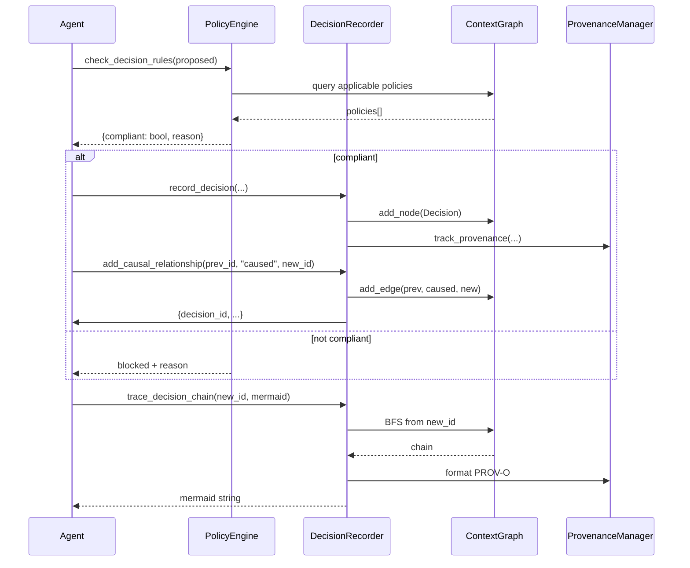

# ch-42 Flow C — 决策智能 / 上下文图谱

> 主轴 C 的端到端剧本: 把每次 AI 决策当成图节点, 串成因果链, 出 PROV-O 审计包。本章复刻 `cookbook/advanced/14_Datalog_Style_Reasoning` 与 `cookbook/introduction/19_Context_Module`。

## 1. 用户视角(User)

### 1.1 我能用它做什么

- 在 Agent 决策点之前调用 `check_decision_rules`, 让不合规决策"提前拒绝"。
- `record_decision` 把每笔决策记为图节点, 挂入 ContextGraph [[ch-55-glossary]]。
- `add_causal_relationship` 串成因果链 (`CAUSED / ENABLED / INFLUENCED / PRECEDENT_FOR`)。
- `find_similar_decisions` 基于 reasoning 嵌入找判例。
- `trace_decision_chain` 输出 mermaid 序列 + W3C PROV-O。

### 1.2 完整端到端剧本 (贷款审批)

```python
from semantica.context.decision_methods import (
    record_decision, add_causal_relationship, find_similar_decisions,
    check_decision_rules, trace_decision_chain,
    create_policy_with_versioning, capture_decision_trace,
)

# 1) 创建策略 (带版本控制)
policy = create_policy_with_versioning(
    name="double_sign_high_value",
    rule={"if": [{"field": "amount", "op": ">", "value": 500_000}],
          "then": "require_dual_signature"},
    created_by="risk@bank.com",
)

# 2) 记录早期决策 (作为判例库)
for i in range(3):
    d = record_decision(
        category="credit_approval",
        scenario=f"Loan #{i}",
        reasoning=f"credit score {700+i*10}, low default risk",
        outcome={"approved": True, "amount": 100_000 + i*50_000},
        confidence=0.85 + i*0.02,
        decided_by="analyst@bank.com",
    )

# 3) 记录当前决策
d_new = record_decision(
    category="credit_approval",
    scenario="Acme Corp 申请 150 万美元",
    reasoning="营收稳定, 36 个月无违约",
    outcome={"approved": True, "amount": 1_500_000},
    confidence=0.92,
    decided_by="analyst@bank.com",
)

# 4) 闸门检查 (150 万 > 50 万阈值 → 需双签)
compliance = check_decision_rules(d_new["id"], policy_ids=[policy["id"]])
print(compliance)
# -> {'compliant': False, 'reason': 'amount > 500000 requires dual signature'}

# 5) 找到相似历史决策 (作为依据)
similar = find_similar_decisions(d_new["id"], top_k=3)
for s in similar:
    print(f"- {s['scenario']} (sim={s['similarity']:.2f})")

# 6) 因果链串接
for s in similar:
    add_causal_relationship(s["id"], "precedent_for", d_new["id"])

# 7) 导出 mermaid 决策链
mermaid = trace_decision_chain(d_new["id"], format="mermaid")
print(mermaid)

# 8) 导出 W3C PROV-O
trace = capture_decision_trace(d_new["id"], format="prov-o-turtle")
```

### 1.3 何时不用

- 你不需要审计 → 跳过 PROV-O。
- 你不需要因果链 → 跳过 `add_causal_relationship`。

## 2. 开发者视角(Developer)

### 2.1 调用的 API 与背后类

| 步骤 | API | 文件 |
|---|---|---|
| 1. 策略创建 | `create_policy_with_versioning` | `context/decision_methods.py:650` |
| 2. 决策记录 | `record_decision` | `context/decision_methods.py:23` |
| 3. 闸门 | `check_decision_rules` | `context/decision_methods.py:698` |
| 4. 判例检索 | `find_similar_decisions` | `context/decision_methods.py:87` |
| 5. 因果链 | `add_causal_relationship` | `context/decision_methods.py` |
| 6. mermaid 导出 | `trace_decision_chain(format="mermaid")` | `context/decision_methods.py:125` |
| 7. PROV-O 导出 | `capture_decision_trace(format="prov-o-turtle")` | `context/decision_methods.py:218` |

### 2.2 关键代码路径

- `semantica/context/decision_methods.py:23` — `record_decision`。
- `semantica/context/decision_methods.py:87` — `find_precedents` / `find_similar_decisions`。
- `semantica/context/decision_methods.py:125` — `get_causal_chain`。
- `semantica/context/decision_methods.py:154` — `get_applicable_policies`。
- `semantica/context/decision_methods.py:181` — `multi_hop_query`。
- `semantica/context/decision_methods.py:218` — `capture_decision_trace`。
- `semantica/context/decision_methods.py:571` — `find_exception_precedents`。
- `semantica/context/decision_methods.py:598` — `analyze_decision_impact`。
- `semantica/context/decision_methods.py:650` — `create_policy_with_versioning`。
- `semantica/context/decision_methods.py:698` — `check_decision_compliance`。
- `semantica/context/decision_methods.py:755` — `get_decision_statistics`。
- `semantica/context/decision_methods.py:840` — `setup_decision_tracking`。
- `semantica/context/decision_models.py` — `Decision / Policy / Precedent / PolicyException / ApprovalChain` dataclass。
- `semantica/context/policy_engine.py` — `PolicyEngine`。
- `semantica/context/context_graph.py` — `ContextGraph`。

### 2.3 最小复现脚本

```python
# examples/ch-42-flow-C-mini.py mirror
import os
os.environ.setdefault("SEMANTICA_LOGGING__LEVEL", "ERROR")

from semantica.context.decision_methods import (
    record_decision, add_causal_relationship, trace_decision_chain,
)

d1 = record_decision(category="demo", scenario="x", reasoning="y",
                     outcome={"ok": True}, confidence=0.9, decided_by="me")
d2 = record_decision(category="demo", scenario="x2", reasoning="y2",
                     outcome={"ok": True}, confidence=0.8, decided_by="me")
add_causal_relationship(d1["id"], "caused", d2["id"])
print(trace_decision_chain(d2["id"], format="mermaid"))
```

### 2.4 扩展点

- **加新决策类别**: 在 `DecisionRecorder._category_policies` 注册新类别对应的策略。
- **加新因果类型**: 扩 `add_causal_relationship(type=...)` 支持新谓词。
- **加新策略语言**: 扩 `Policy.rule` 支持 CEL / JSONLogic / 自定义 DSL。

## 3. 架构师视角(Architect)

### 3.1 这条主轴揭示的"决策也是图节点"哲学

传统决策支持 (DSS) 把"决策"当 metadata (在数据库表里), 不参与图遍历。

Semantica 把决策升格为一等图节点, 带来三大能力:

- **跨决策因果推理** (`add_causal_relationship`)。
- **判例检索** (基于 reasoning 嵌入)。
- **策略闸门** (在决策点上实时检查合规)。

代价: ContextGraph 数据量增长快, 需考虑 Neo4j cluster。

### 3.2 与同类对比

| 维度 | Semantica decision | LangSmith | Helicone |
|---|---|---|---|
| 决策节点 | ✅ 一等 | ⚠ trace | ⚠ log |
| 因果链 | ✅ | ❌ | ❌ |
| 闸门 | ✅ | ❌ | ❌ |
| PROV-O | ✅ | ❌ | ❌ |

### 3.3 何时重新设计

- 决策数 > 10M → 必上独立图库 (Neo4j cluster)。
- 实时决策 (<100ms) → 引入决策图缓存 + Redis。

## 本章图表

### FIG-08 决策图运作时序



图说: 一次合规决策的全链路时序; 不合规时直接阻断。

## 跨章引用

- 上一章: [[ch-41-flow-b-multi-source]]
- 决策细节: [[ch-21-context-decision]]
- 推理: [[ch-16-reasoning]]
- 溯源: [[ch-20-provenance]]