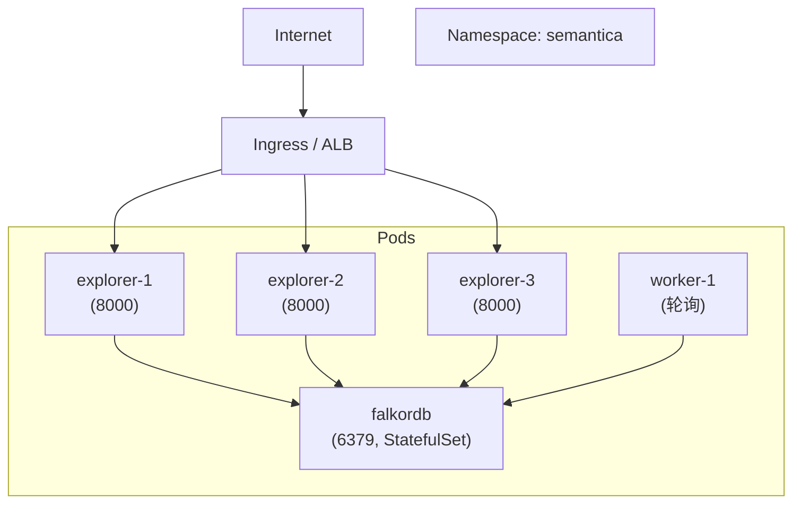

# ch-44 Kubernetes / Helm — 生产部署

> 用 K8s + Helm 在生产跑 Semantica。本章讲解完整 K8s manifests + Helm chart + 生产覆盖。

## 1. 用户视角(User)

### 1.1 我能用它做什么

- 完整 K8s manifests: deployment / service / ingress / configmap / secret / networkpolicy / namespace / kustomization。
- Helm chart: `Chart.yaml / values.yaml / values.prod.yaml / templates/*`。
- Kustomize 友好 (`kustomization.yaml`)。
- 网络隔离 (`NetworkPolicy`) + 密钥管理 (`Secret.yaml`)`).

### 1.2 一段最小可跑示例

```bash
# Kustomize 部署
kubectl apply -k deploy/kubernetes/

# Helm 部署
helm install semantica deploy/helm/knowledge-explorer/ \
  --namespace semantica --create-namespace \
  --values deploy/helm/knowledge-explorer/values.prod.yaml

# 检查
kubectl get pods -n semantica
kubectl port-forward -n semantica svc/semantica 8000:8000
curl http://localhost:8000/health
```

### 1.3 何时不用

- 单机 → 用 [ch-43-docker-compose]。
- Serverless → 用 [ch-45-cloud-platforms]。

## 2. 开发者视角(Developer)

### 2.1 关键代码路径

- `deploy/kubernetes/deployment.yaml` — Deployment (replicas + resources + probes)。
- `deploy/kubernetes/service.yaml` — ClusterIP Service。
- `deploy/kubernetes/ingress.yaml` — Ingress (nginx / traefik)。
- `deploy/kubernetes/configmap.yaml` — ConfigMap (`ALLOWED_ORIGINS` / `FALKORDB_HOST` / `FALKORDB_PORT`)。
- `deploy/kubernetes/secret.yaml.example` — Secret 模板 (`FALKORDB_PASSWORD`)。
- `deploy/kubernetes/networkpolicy.yaml` — NetworkPolicy (限制 pod 间流量)。
- `deploy/kubernetes/namespace.yaml` — 独立 namespace。
- `deploy/kubernetes/kustomization.yaml` — Kustomize 入口。
- `deploy/helm/knowledge-explorer/Chart.yaml` — Helm chart 元数据。
- `deploy/helm/knowledge-explorer/values.yaml` — Helm 默认值。
- `deploy/helm/knowledge-explorer/values.prod.yaml` — 生产覆盖。
- `deploy/helm/knowledge-explorer/templates/` — deployment / service / ingress / configmap / secret / hpa。

### 2.2 values.prod.yaml 示例

```yaml
replicaCount: 3
image:
  repository: semantica/explorer
  tag: "0.6.0"
  pullPolicy: IfNotPresent

resources:
  requests:
    cpu: 500m
    memory: 1Gi
  limits:
    cpu: 2000m
    memory: 4Gi

env:
  ALLOWED_ORIGINS: "https://example.com"
  FALKORDB_HOST: "falkordb.svc.cluster.local"
  FALKORDB_PORT: "6379"

ingress:
  enabled: true
  className: nginx
  annotations:
    cert-manager.io/cluster-issuer: letsencrypt-prod
  hosts:
    - host: kg.example.com
      paths: [/]

autoscaling:
  enabled: true
  minReplicas: 2
  maxReplicas: 10
  targetCPUUtilizationPercentage: 80

```

### 2.3 最小复现脚本

```bash
# 用 kustomize 部署到 minikube
minikube start
kubectl apply -k deploy/kubernetes/
kubectl get all -n semantica
```

### 2.4 扩展点

- **加 HPA**: 在 `values.yaml` 启用 `autoscaling`。
- **加 PodDisruptionBudget**: 在 `templates/` 加 `pod-disruption-budget.yaml`。
- **加 ServiceMonitor** (Prometheus): 在 `templates/` 加 `servicemonitor.yaml`。

## 3. 架构师视角(Architect)

### 3.1 设计取舍

**为什么同时给 Kustomize 和 Helm?**
- Kustomize 是 K8s 原生, 适合"少量覆盖 + GitOps"。
- Helm 是"模板化打包", 适合"跨环境 + 多实例"。
- Semantica 不偏袒一方, 同时提供, 让用户按团队惯例选。

**为什么默认 3 副本?**
- 生产 K8s 通常 3+ 副本实现 HA, Semantica ContextGraph [[ch-55-glossary]] 内存图是无状态, 但 FalkorDB 是有状态。
- FalkorDB 用 StatefulSet + 持久卷 (不在本 chart, 由用户自配)。

### 3.2 与同类对比

| 维度 | Semantica K8s | LangServe | LlamaIndex Deploy |
|---|---|---|---|
| Manifest 完整度 | 8 (deploy/svc/ingress/cm/secret/netpol/ns/kustomize) | 3 | 2 |
| Helm chart | ✅ | ⚠ | ❌ |
| NetworkPolicy | ✅ | ❌ | ❌ |

### 3.3 何时重新设计

- 服务 > 10 → 拆微服务 chart (`chart-explorer` / `chart-worker` / `chart-mcp`)。
- 出现"金丝雀发布" → 引入 Argo Rollouts。

## 本章图表

### FIG-10 部署拓扑



图说: 3 Explorer 副本 + 1 worker + 1 FalkorDB StatefulSet, 由 Ingress 统一入口。

## 跨章引用

- 上一章: [[ch-43-docker-compose]]
- 下一章: [[ch-45-cloud-platforms]]
- 网络与安全: [[ch-49-security]]