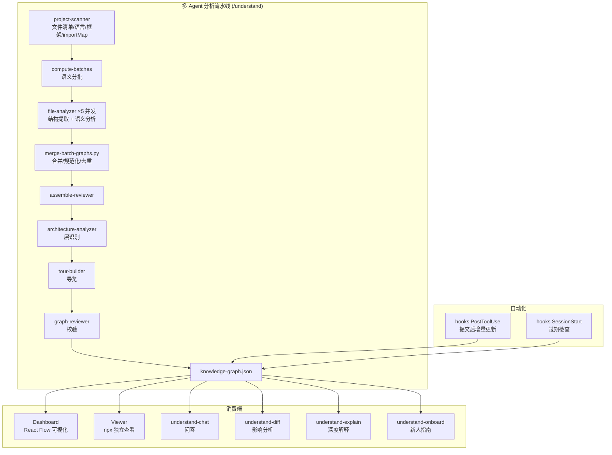
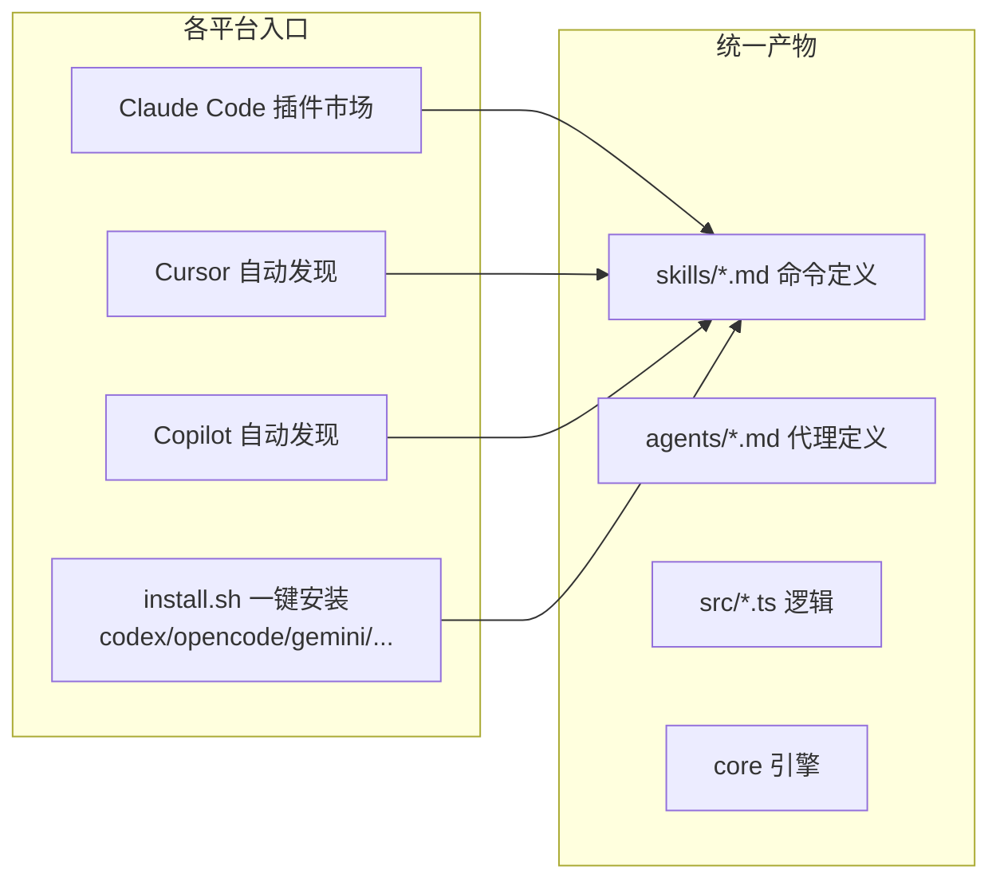

# Understand Anything 深度解析手册

> 一个把任何代码库、知识库、文档转成**可交互知识图谱**的开源工具
>
> —— 从用户、开发者、架构师三个视角，深入浅出地拆解 `understand-anything` 的完整源码

---

## 目录

- [第一篇 · 总览](#第一篇--总览)
- [第二篇 · 用户视角：从安装到精通](#第二篇--用户视角从安装到精通)
- [第三篇 · 开发者视角：源码地图与扩展指南](#第三篇--开发者视角源码地图与扩展指南)
- [第四篇 · 架构师视角：设计哲学与系统设计](#第四篇--架构师视角设计哲学与系统设计)
- [第五篇 · 附录](#第五篇--附录)

---

# 第一篇 · 总览

## 1.1 这是什么？

**Understand Anything（下称 UA）** 是一个开源项目，它用一条「**多 Agent 流水线**」分析你的项目，产出一份 `knowledge-graph.json`，再启动一个交互式 Web Dashboard 让你可视化地探索代码结构、业务领域、知识库内容。

> **核心价值主张**：不是生成一张「看起来复杂的图」，而是一张「悄悄教会你每个零件如何拼在一起」的图。

```
┌─────────────────────────────────────────────────────────────────┐
│                     Understand Anything 全景                      │
│                                                                   │
│  ┌────────────┐     ┌─────────────┐     ┌────────────────────┐   │
│  │  你的代码库  │ ──▶ │  多 Agent    │ ──▶ │  knowledge-graph.json │   │
│  │  /知识库/文档 │     │  流水线      │     │   (纯 JSON 产物)       │   │
│  └────────────┘     └─────────────┘     └──────────┬─────────┘   │
│                                                     │            │
│                                                     ▼            │
│                                            ┌────────────────────┐  │
│                                            │  交互式 Web Dashboard│  │
│                                            │  (React + React Flow)│  │
│                                            └────────────────────┘  │
└─────────────────────────────────────────────────────────────────┘
```

## 1.2 技术栈速览

| 层次 | 技术 | 说明 |
|---|---|---|
| 包管理 | pnpm workspace（monorepo） | Node ≥ 22，pnpm ≥ 10 |
| 语言 | TypeScript（严格模式）、少量 Python（合并脚本）、MJS | ESM 模块 |
| 静态分析 | **web-tree-sitter**（WASM） | 13 种语言 AST 提取；不用 native 绑定（darwin/arm64 + Node 24 兼容性） |
| 语义分析 | LLM（多 Agent 调用） | 摘要、标签、层级、导览、领域模型 |
| 数据模型 | Zod（schema 校验） | 27 种节点、38 种边、layer、tour |
| Dashboard | React 19 + Zustand + React Flow + Tailwind v4 | 深色奢华主题 |
| 布局算法 | ELK / d3-force / Louvain / dagre | Web Worker 中运行 |
| 搜索 | Fuse.js（模糊）+ 向量余弦（语义） | |

## 1.3 一个典型使用场景

1. 你加入了一个 20 万行代码的新团队 → 运行 `/understand`
2. 流水线扫描全部文件，抽出函数/类/依赖，LLM 生成语义摘要
3. 产出 `.ua/knowledge-graph.json`，并自动启动 Dashboard
4. 你按「分层图」看架构，点任意节点看摘要 + 代码，跟着「导览」按依赖顺序学习
5. 之后可以 `/understand-chat` 提问、`/understand-diff` 评估改动影响、`/understand-onboard` 生成新人指南

---

# 第二篇 · 用户视角：从安装到精通

## 2.1 安装

### Claude Code（原生）

```bash
/plugin marketplace add Egonex-AI/Understand-Anything
/plugin install understand-anything
```

### 其他平台（17 种）一键安装

```bash
curl -fsSL https://raw.githubusercontent.com/Egonex-AI/Understand-Anything/main/install.sh | bash
# 或指定平台
curl -fsSL https://raw.githubusercontent.com/Egonex-AI/Understand-Anything/main/install.sh | bash -s codex
```

Windows：`iwr -useb https://raw.githubusercontent.com/Egonex-AI/Understand-Anything/main/install.ps1 | iex`

> ⚠️ **调用前缀不同**：多数平台用 `/understand`，但 **Codex 用 `$understand`**。不确定时直接自然语言说 "Use the understand skill to analyze this project."

### 平台兼容矩阵（v2.9.4）

| 平台 | 状态 | 安装方式 |
|---|---|---|
| Claude Code | ✅ 原生 | 插件市场 |
| Cursor | ✅ | 克隆后自动发现 |
| VS Code + Copilot | ✅ | 克隆后自动发现 |
| Copilot CLI | ✅ | `copilot plugin install` |
| Codex / OpenCode / Gemini CLI / Pi / Vibe / Hermes / Cline / KIMI / Trae / Nanobot / Kiro / OpenClaw / Antigravity | ✅ | `install.sh <platform>` |

## 2.2 命令速查表

| 命令 | 作用 | 关键参数 |
|---|---|---|
| `/understand` | 主命令：分析项目生成知识图谱 | `[path]`、`--full`、`--auto-update`、`--review`、`--language <lang>`、`--exclude <patterns>` |
| `/understand-chat <问题>` | 基于图谱回答代码问题 | 问题描述 |
| `/understand-dashboard` | 启动交互式 Dashboard | `[project-path]` |
| `/understand-diff` | 分析当前改动的影响范围 | `[PR号]` |
| `/understand-explain <文件>` | 深度解释某个文件/函数 | 文件路径 |
| `/understand-onboard` | 生成新人上手指南 | — |
| `/understand-domain` | 提取业务领域（域/流程/步骤） | — |
| `/understand-knowledge <wiki路径>` | 分析知识库（Karpathy 式 wiki） | 目录路径 |
| `/understand-figma <文件key>` | 分析 Figma 设计文件 | 文件 key |

## 2.3 第一次 `/understand` 会发生什么

```
[Phase 0/7]  Pre-flight（参数解析、git 定位、数据目录解析）
[Phase 0.5/7] .understandignore 生成与确认
[Phase 1/7]  Scanning project files...（project-scanner）
[Phase 1.5/7] Computing semantic batches...（语义分批）
[Phase 2/7]  Analyzing files — N files in M batches (up to 5 concurrent)...
[Phase 3/7]  Reviewing assembled graph...
[Phase 4/7]  Identifying architectural layers...
[Phase 5/7]  Building guided tour...
[Phase 6/7]  Validating knowledge graph...
[Phase 7/7]  Saving knowledge graph...
```

**产物文件**（位于项目数据目录）：

| 文件 | 作用 |
|---|---|
| `.ua/knowledge-graph.json` | 最终知识图谱（核心产物） |
| `.ua/meta.json` | 元数据（git commit、分析时间、文件数） |
| `.ua/config.json` | 配置（autoUpdate、outputLanguage） |
| `.ua/.understandignore` | 排除规则（首次自动生成，供你确认） |
| `.ua/intermediate/` | 中间产物（分析后清理，保留 scan-result.json） |

> **Legacy 兼容**：若项目已存在 `.understand-anything/` 目录，则继续使用它作为数据目录，无需迁移。

### 常用参数说明

| 参数 | 说明 |
|---|---|
| `--full` | 强制全量重建 |
| `--auto-update` | 开启提交后自动增量更新（写入 config.json） |
| `--review` | 用完整 LLM graph-reviewer 替代内联确定性校验 |
| `--language zh` | 所有文本内容（摘要/标签/导览/Dashboard UI）用中文生成；首次运行会自动检测对话语言并确认一次，偏好存入 config.json |
| `--exclude "tests/*,docs/*"` | 追加排除模式（最高优先级，支持 `!` 反选） |
| `/understand src/frontend` | 只分析子目录（超大仓库推荐） |

## 2.4 Dashboard 使用指南

### 布局

```
┌──────────────────────────────────────────────┬──────────────────┐
│                                              │  侧边栏 (360px)   │
│                                              │  ┌────────────┐  │
│             知识图谱画布 (75%)                │  │ Info │ Files│  │
│     · 节点按架构分层着色                       │  └────────────┘  │
│     · 支持缩放/平移/框选                       │  · ProjectOverview│
│     · 容器折叠/展开                           │  · NodeInfo       │
│     · Diff 高亮                              │  · LearnPanel     │
│                                              │  · FileExplorer   │
├──────────────────────────────────────────────┴──────────────────┤
│  底部：代码查看器（点击文件节点从底部滑出，可升级全屏）               │
└──────────────────────────────────────────────────────────────────┘
```

### 核心交互

1. **分层总览**：默认 `Info` 标签显示项目总览；点任意节点切换为 `NodeInfo`（摘要、标签、复杂度、关系列表）
2. **代码查看**：点击文件节点 → 底部滑出 prism 高亮代码查看器；展开按钮可升级为全屏
3. **聚焦模式**：聚焦某节点的 1 跳邻居，隔离无关内容
4. **导览 (Tour)**：按依赖顺序的引导式学习路径，每一步自动导航到对应层并高亮节点
5. **Persona（身份自适应）**：non-technical / junior / experienced，UI 细节随身份变化
6. **搜索**：模糊搜索（fuse）与语义搜索（向量）双模式
7. **筛选面板**：按节点类型 / 复杂度 / 层 / 边类别过滤
8. **Diff 覆盖层**：`/understand-diff` 后运行，改动节点与受影响节点高亮
9. **路径查找器**：找两个节点间的关系路径
10. **导出菜单**：导出子图 / 布局数据

### 主题系统

深色奢华主题：深黑底（`#0a0a0a`）+ 金/琥珀点缀（`#d4a574`）+ DM Serif Display 字体。可通过 `ThemePicker` 切换主题与强调色预设。

## 2.5 分享与团队协作

知识图谱就是一份 JSON —— **提交到仓库，队友跳过流水线直接看**：

```gitignore
# 提交 .ua/ 时排除中间产物
.ua/intermediate/
.ua/diff-overlay.json
```

```bash
# 大图（10MB+）用 git-lfs
git lfs install
git lfs track ".ua/*.json"
```

**无 Claude Code 查看方式**（只需要 Node ≥ 18）：

```bash
npx https://github.com/Egonex-AI/Understand-Anything/releases/latest/download/understand-anything-viewer.tgz /path/to/project
```

终端会打印带 token 的 URL（`http://127.0.0.1:5173/?token=…`）并自动打开浏览器。数据全部在本地磁盘只读提供，**没有 LLM 调用，数据不出机器**。

> 示例：[GoogleCloudPlatform/microservices-demo](https://github.com/GoogleCloudPlatform/microservices-demo) 提交了图谱，可直接体验。

## 2.6 常见问题（用户篇）

| 问题 | 解答 |
|---|---|
| 大项目 token 消耗大？ | 首次全量分析确实费 token；后续默认**增量**（只重分析改动文件）；可用本地模型（Ollama）初始化 |
| 只报进度不产出？ | 100+ 文件时提示范围过大，建议用子目录参数：`/understand src/` |
| Dashboard 打不开 | 确保 URL 带 `?token=`；token 门禁见「架构篇-安全设计」 |
| 语言想换？ | `/understand --language zh-TW`，或改 `.ua/config.json` 的 `outputLanguage` |

---

# 第三篇 · 开发者视角：源码地图与扩展指南

## 3.1 Monorepo 结构总览

```
understand-anything-plugin/          ← 插件根（含全部源码）
├── package.json                     ← @understand-anything/skill (v2.9.4)
├── packages/
│   ├── core/                        ← ★ 共享分析引擎（核心中的核心）
│   │   └── src/
│   │       ├── schema.ts            ← Zod 图谱 schema + 4 层校验
│   │       ├── types.ts             ← 27 节点 / 38 边 / 各 meta 接口
│   │       ├── search.ts            ← Fuse.js 模糊搜索
│   │       ├── embedding-search.ts  ← 语义搜索（余弦相似度）
│   │       ├── staleness.ts         ← 新鲜度判断（增量更新）
│   │       ├── fingerprint.ts       ← 文件指纹（结构变化检测）
│   │       ├── change-classifier.ts ← 变更分类（决定更新策略）
│   │       ├── ignore-filter.ts     ← .understandignore 过滤
│   │       ├── ignore-generator.ts  ← 生成 .understandignore 初始文件
│   │       ├── persistence/         ← 图谱 JSON 读写 + 路径消毒
│   │       ├── analyzer/
│   │       │   ├── graph-builder.ts ← 确定性构图（节点/边组装）
│   │       │   ├── llm-analyzer.ts  ← LLM prompt 构建 + 响应解析
│   │       │   ├── normalize-graph.ts ← ID/复杂度/别名规范化
│   │       │   ├── layer-detector.ts  ← 架构层检测
│   │       │   ├── tour-generator.ts  ← 导览生成
│   │       │   └── language-lesson.ts ← 语言概念讲解
│   │       ├── languages/           ← 40+ 语言配置 / 10 框架配置 / 注册表
│   │       └── plugins/
│   │           ├── tree-sitter-plugin.ts ← 主插件（WASM）
│   │           ├── registry.ts      ← 插件注册表
│   │           ├── discovery.ts     ← 插件配置解析
│   │           ├── extractors/      ← 13 种语言结构提取器
│   │           └── parsers/         ← 12 种非代码解析器
│   ├── dashboard/                   ← ★ React 交互式 Dashboard
│   │   └── src/
│   │       ├── store.ts             ← Zustand 全局状态
│   │       ├── App.tsx / main.tsx
│   │       ├── components/          ← 30+ 组件（GraphView 等）
│   │       ├── utils/               ← 布局（ELK/force/Louvain）worker
│   │       ├── themes/              ← 主题引擎 + 预设
│   │       ├── contexts/I18nContext.tsx + locales/ ← 6 语言
│   │       └── freshness.ts
│   ├── viewer/                      ← 独立只读查看器（无 LLM）
│   ├── tree-sitter-dart-wasm/       ← Dart 语法 WASM
│   └── tree-sitter-swift-wasm/      ← Swift 语法 WASM
├── skills/                          ← ★ 10 个 skill 定义（SKILL.md）
│   ├── understand/                  ← 主 skill + 8 个捆绑脚本
│   │   ├── SKILL.md                 ← 7 阶段流水线完整编排
│   │   ├── scan-project.mjs         ← 确定性文件扫描
│   │   ├── extract-import-map.mjs   ← 13 语言 import 解析
│   │   ├── compute-batches.mjs      ← 语义分批
│   │   ├── extract-structure.mjs    ← 结构提取
│   │   ├── merge-batch-graphs.py    ← 批量图合并 + 规范化
│   │   ├── build-fingerprints.mjs   ← 指纹基线
│   │   ├── generate-ignore.mjs      ← ignore 文件生成
│   │   ├── merge-subdomain-graphs.py ← 子域图合并
│   │   ├── languages/ frameworks/ locales/  ← 注入的上下文提示
│   ├── understand-chat/ understand-diff/ ...  ← 其余 skill
├── agents/                          ← ★ 10 个 Agent 定义（md）
├── src/                             ← Skill TS 源码
│   ├── understand-chat.ts           ← 聊天 prompt 组装
│   ├── diff-analyzer.ts             ← diff 分析
│   ├── explain-builder.ts           ← 解释构建
│   ├── onboard-builder.ts           ← 上手指南构建
│   └── context-builder.ts           ← 图谱上下文提取
└── hooks/                           ← 自动化钩子
    ├── hooks.json                   ← PostToolUse / SessionStart
    └── post-tool-use-auto-update.mjs ← 提交后自动增量更新
```

## 3.2 core 包 —— 分析引擎详解

### 3.2.1 schema.ts：知识图谱的数据契约

核心数据模型由 Zod 定义，包含：

- **27 种节点类型**，分 5 组：
  - 代码：`file` `function` `class` `module` `concept`
  - 非代码：`config` `document` `service` `table` `endpoint` `pipeline` `schema` `resource`
  - 领域：`domain` `flow` `step`
  - 知识：`article` `entity` `topic` `claim` `source`
  - 设计：`page` `screen` `component` `componentSet` `instance` `token`
- **38 种边类型**，分 9 大类（结构化/行为/数据流/依赖/语义/基础设施/领域/知识/设计）
- `layers[]`（架构层）、`tour[]`（导览步骤）、`project`（项目元信息）

**四层防御式校验流水线**（`validateGraph`）：

```
原始数据
   │
   ▼ Tier 1  sanitizeGraph      → null 转空数组、枚举小写化
   ▼ Tier 2  normalizeGraph     → 别名归一（LLM 常见错误：func→function,
   │                              page→article(非设计图)、instance_of→exemplifies）
   ▼ Tier 3  autoFixGraph       → 缺失字段补默认值、weight 越界钳制
   ▼ Tier 4  严格校验           → Zod 校验，坏节点/坏边逐个丢弃并记录 issue
```

> **设计亮点**：schema 不是"要么全对要么全错"，而是**分层降级**——能修的自动修（`auto-corrected`），修不了的丢弃（`dropped`），整个图坏了才失败（`fatal`）。这让 LLM 产出的"脏数据"也能被安全吸收。

### 3.2.2 plugins/：可插拔的语言分析

- **registry.ts**：`PluginRegistry` 维护 `语言 → 插件` 映射，统一 `analyzeFile` / `resolveImports` / `extractCallGraph` / `analyzeFileFull`（单次解析快路径）接口
- **extractors/**：13 种语言的 tree-sitter 提取器（TS/JS、Python、Go、Rust、Java、Ruby、PHP、C/C++、C#、Dart、Kotlin、Swift、Scala），继承 `base-extractor.ts` 的 AST 遍历工具
- **parsers/**：12 种非代码解析器 —— Markdown、YAML、JSON、TOML、Env、Dockerfile、SQL、GraphQL、Protobuf、Terraform、Makefile、Shell
- **languages/**：`LanguageRegistry` 做 扩展名 → 语言 映射（40+ 配置），`FrameworkRegistry` 识别框架（React/Vue/Django/Spring…）

> **为什么不手写正则？** tree-sitter 产出的是**具体语法树（CST）**，对注释、字符串内的"伪代码"免疫；同一输入永远同一输出（确定性），这是增量更新指纹的基石。

### 3.2.3 analyzer/：确定性 + 语义的混合

| 模块 | 职责 |
|---|---|
| `graph-builder.ts` | 把 `StructuralAnalysis` 组装成节点和边（`contains`/`imports`/`calls`），ID 规则：`file:路径`、`function:路径:函数名` |
| `llm-analyzer.ts` | 构建文件/项目分析 prompt，`extractJson` 处理 LLM 的 markdown 围栏包裹，解析并规范化返回 |
| `normalize-graph.ts` | 修正双前缀、项目名前缀，规范化复杂度（`low→simple`） |
| `layer-detector.ts` | 让 LLM 识别架构层（API/Service/Data/UI…），再归一化 |
| `tour-generator.ts` | 生成按依赖排序的导览，附语言概念讲解 |
| `language-lesson.ts` | 检测泛型/闭包/装饰器等 12 种语言模式并给出现场讲解 |

### 3.2.4 增量更新的"指纹"机制

```
fingerprint.ts   → 每个文件的函数/类/import 指纹（结构签名）
change-classifier.ts → classifyUpdate：
                        · STRUCTURAL   → 结构变了（重分析）
                        · COSMETIC     → 只改注释/空白（跳过）
                        · FULL_UPDATE  → 无法确定（升级为全量）
staleness.ts     → 判断图谱相对 HEAD 的新鲜度
```

这是 `/understand` 默认"增量"的底层支撑：**同一个文件内容 → 同一个指纹**，只有结构变化才触发重分析，极大节省 token。

## 3.3 dashboard 包 —— 前端图谱画布

### 核心组件

| 组件 | 职责 |
|---|---|
| `GraphView.tsx` | 主画布（React Flow），分层渲染、容器折叠、Diff 高亮 |
| `KnowledgeGraphView.tsx` | 图数据 → React Flow 节点的适配层 |
| `store.ts` | Zustand store：图谱、选择、导览、筛选、Diff 覆盖层、容器布局缓存、导航历史（50 步） |
| `CodeViewer.tsx` | prism 高亮代码查看器（底部滑出 + 全屏） |
| `NodeInfo.tsx` / `ProjectOverview.tsx` / `LearnPanel.tsx` | Info 标签页三态 |
| `FileExplorer.tsx` | 从结构图构建的文件树 |
| `FilterPanel.tsx` / `SearchBar.tsx` / `PathFinderModal.tsx` | 筛选/搜索/寻路 |
| `TokenGate.tsx` | 访问令牌门禁 |
| `StalenessBanner.tsx` | 图谱过期提醒 |
| `DiffToggle.tsx` | Diff 模式开关 |

### 布局引擎（utils/）

```
layout.ts
 ├── elk-layout.ts         → ELK 分层布局（架构层视图，主）
 ├── force-layout.ts       → d3-force 力导向（领域/知识视图）
 ├── louvain.ts            → 社区聚类（知识图谱分组）
 ├── containers.ts         → 容器折叠策略（文件夹/社区）
 └── layout.worker.ts / force-layout.worker.ts → Web Worker 中执行，避免阻塞 UI
```

> **Dashboard 只导入 core 的浏览器安全子路径**：`@understand-anything/core/search`、`/types`、`/schema` —— 绝不导入主入口（会拉入 Node.js 模块，见架构篇权衡）。

## 3.4 skills/ —— 10 个命令的定义

每个 skill 是一个 `SKILL.md`（带 frontmatter 的指令文件），被主 Agent 读取后逐条执行。核心是 `understand/SKILL.md`（约 7 阶段流水线的完整编排脚本，见架构篇）。

**skill 捆绑脚本**（`understand/` 目录下的 8 个脚本）分工明确：扫描、import 解析、分批、结构提取、合并、指纹、ignore 生成、子域合并 —— 把**确定性工作全部下沉到脚本**，LLM 只做语义判断。这是 token 效率的关键。

## 3.5 agents/ —— 10 个专职 Agent

| Agent | 职责 | 流水线阶段 |
|---|---|---|
| `project-scanner` | 扫描文件、检测语言/框架、生成 importMap | Phase 1 |
| `file-analyzer` | 结构提取 + 语义分析，产出节点和边 | Phase 2（×5 并发） |
| `assemble-reviewer` | 审查合并后的图 | Phase 3 |
| `architecture-analyzer` | 识别架构层 | Phase 4 |
| `tour-builder` | 生成引导导览 | Phase 5 |
| `graph-reviewer` | 完整性/引用完整性校验 | Phase 6（`--review` 时） |
| `domain-analyzer` | 提取业务领域/流程/步骤 | `/understand-domain` |
| `article-analyzer` | 从 wiki 文章提取实体/主张/隐式关系 | `/understand-knowledge` |
| `design-analyzer` | 分析 Figma 设计 | `/understand-figma` |
| `knowledge-graph-guide` | 图谱知识指南（供其他 agent 参考） | — |

> **重要约定**：Agent 的 `model` 字段**不写在 frontmatter 里**，让各平台回落各自默认模型。`inherit` 曾是 Claude Code 专用关键词，opencode 等平台会把它当字面 model id 拒绝（`ProviderModelNotFoundError`，issue #167）。

## 3.6 开发工作流

```bash
# 安装
pnpm install

# 构建
pnpm --filter @understand-anything/core build
pnpm --filter @understand-anything/skill build
pnpm --filter @understand-anything/dashboard build

# 测试（Vitest）
pnpm --filter @understand-anything/core test
pnpm test          # 全部测试（skill 测试在 repo-root tests/skill/）

# Lint
pnpm lint

# Dashboard 开发
pnpm dev:dashboard
```

**测试布局**：
- core 单测：`packages/core/src/__tests__/`（schema、search、指纹、解析器、提取器等）
- dashboard 单测：`packages/dashboard/src/**/__tests__/`
- skill 集成测试：`tests/skill/`（根 vitest.config.ts 统一收集）
- 基准测试：`tests/benchmark/`（大仓库 schema/性能）

### 本地测试插件修改（Claude Code 缓存技巧）

```bash
pnpm --filter @understand-anything/core build
pnpm --filter @understand-anything/skill build

# 找到已安装版本号
ls ~/.claude/plugins/cache/understand-anything/understand-anything/

# 覆盖缓存（<VERSION> 替换为上面列出的版本）
rm -rf ~/.claude/plugins/cache/understand-anything/understand-anything/<VERSION>
cp -R ./understand-anything-plugin ~/.claude/plugins/cache/understand-anything/understand-anything/<VERSION>
# 重开 Claude Code 会话后运行 /understand --full 验证
```

## 3.7 发布与版本管理

推送远端前需同步 **6 个文件** 的版本号：

1. `understand-anything-plugin/package.json`
2. `understand-anything-plugin/.claude-plugin/plugin.json`
3. `understand-anything-plugin/packages/viewer/package.json`
4. `.claude-plugin/plugin.json`
5. `.cursor-plugin/plugin.json`
6. `.copilot-plugin/plugin.json`

> `.claude-plugin/marketplace.json` **不带版本** —— plugins[] 只支持 name 和 source，加其他字段会导致 marketplace schema 校验失败。

每次发布还要**重新打包并上传 viewer tarball**（`understand-anything-viewer.tgz`，名字必须精确）到 GitHub Release —— README 里的 `releases/latest/download/` URL 依赖它。

## 3.8 扩展指南（动手实践）

### 扩展点 A：新增一种语言的结构提取

1. 在 `packages/core/src/plugins/extractors/` 新建 `xx-extractor.ts`，实现 `LanguageExtractor`（`analyzeFile` 返回 functions/classes/imports/exports）
2. 在 `extractors/index.ts` 注册到 `builtinExtractors`
3. 在 `languages/configs/` 添加语言配置（扩展名 → 语言 id）
4. 在 `languages/` 下添加 `xx.md`（给 architecture-analyzer 的语言上下文）
5. 写测试：参考 `python-extractor.test.ts` 模式

### 扩展点 B：新增非代码解析器

1. 在 `plugins/parsers/` 新建 `xx-parser.ts`，产出 `definitions/services/endpoints/steps/resources`
2. 在 `parsers/index.ts` 的 `registerAllParsers` 注册
3. 在 `graph-builder.ts` 的 `KIND_TO_NODE_TYPE` 映射新 kind → 节点类型

### 扩展点 C：新增一个 skill

1. 新建 `skills/my-skill/SKILL.md`（frontmatter 声明 name/description）
2. 复用以 `$UA_DIR/knowledge-graph.json` 为核心的读取模式（见 understand-chat）
3. 需要复杂逻辑时，可加 `src/my-skill.ts` 并导出（参照 `understand-chat.ts`）

### 扩展点 D：新增平台

1. 在 `install.sh` / `install.ps1` 添加平台分支（克隆到 `~/.understand-anything/repo` + 创建对应 symlink）
2. 添加平台插件描述文件（`.claude-plugin`、`.cursor-plugin`、`.copilot-plugin` 模式）
3. 更新 README 平台矩阵

---

# 第四篇 · 架构师视角：设计哲学与系统设计

## 4.1 设计哲学：三支柱

### 支柱一：确定性 + 语义的混合分工

```
┌───────────────────────┬────────────────────────────┐
│  tree-sitter（确定性）  │      LLM（语义）            │
├───────────────────────┼────────────────────────────┤
│ imports/exports       │ 摘要（文件是干什么的）        │
│ 函数/类定义            │ 标签、复杂度评级             │
│ 调用点、继承关系        │ 架构层划分                   │
│ 指纹（增量检测）        │ 业务域映射、导览、语言概念    │
│ 同一输入 → 同一输出     │ 意图捕获（不止于依赖）        │
└───────────────────────┴────────────────────────────┘
```

这个分工带来两个关键收益：**结构边可复现**（同一代码永远产出同一张结构图，可做指纹/增量），**语义边有意义**（告诉你看代码的人"为什么"）。

### 支柱二：图即契约（Graph-as-Contract）

知识图谱是**唯一的中间表示**。一切 skill（chat/diff/explain/onboard）、dashboard、viewer 都只依赖 `knowledge-graph.json` 这一个 JSON 契约。上游（分析流水线）与下游（消费端）彻底解耦。

### 支柱三：LLM 不可信（Defensive Schema）

LLM 产出天然不可靠（类型别名满天飞：`func`/`fn`/`method`、`extends`→`inherits`）。schema 层用四层防御式校验吸收脏数据，而不是拒绝。这是该系统能在真实世界稳定运行的根因。

## 4.2 总体架构



## 4.3 数据模型详解

### 节点 ID 命名空间（幂等设计）

```
file:src/App.tsx
function:src/App.tsx:renderApp
class:src/App.tsx:App
config:tsconfig.json
document:README.md
service:docker-compose.yml:web
endpoint:api/openapi.yaml:GET /users
```

ID 由 `类型前缀 + 路径 + 名字` 组成 → **天然稳定、跨批次可合并、可去重**。合并脚本可以安全地对同 ID 节点取"最后出现"，对 `(source, target, type)` 边去重。

### 别名表：LLM 纠错的第一道防线

`normalizeGraph` 按图的 `kind`（codebase/knowledge/design）切换别名表：

| 场景 | 示例 |
|---|---|
| 通用别名 | `func/fn/method → function`、`extends → inherits`、`low → simple` |
| 非设计图特例 | `page → article`（不能把 wiki 页当 Figma 页面） |
| 设计图特例 | `frame → screen`、`instance_of` 保持（知识图里映射为 `exemplifies`） |

> 有趣的坑（源码注释里都有）：`implemented_by` **故意不**别名成 `implements`（方向相反）；`process` **故意不**别名成 `flow`（和 OS/Node 进程混淆）；`componentSet` 是唯一 camelCase 类型，小写化后要映射回来。

### 边类型 9 大类（38 种）

```
结构化    imports exports contains inherits implements
行为      calls subscribes publishes middleware
数据流    reads_from writes_to transforms validates
依赖      depends_on tested_by configures
语义      related similar_to
基础设施  deploys serves provisions triggers
Schema   migrates documents routes defines_schema
领域      contains_flow flow_step cross_domain
知识      cites contradicts builds_on exemplifies categorized_under authored_by
设计      instance_of variant_of uses_token
```

## 4.4 7 阶段流水线深度拆解

### Phase 0 —— Pre-flight：看似平凡的关键决策

- **Worktree 重定向**：若项目在 git worktree（Claude Code 管理的临时 checkout）中，把输出重定向到主仓库根 —— 否则图谱随会话销毁（issue #133）
- **插件根解析**：多平台下 `~/.agents/skills/understand` 可能是 symlink，不能假设"skill 路径往上两级"就是插件根，按运行时环境变量 → 通用 symlink → 克隆路径逐级探测
- **`UA_DIR` 解析**：`.understand-anything/` 存在则用它（legacy 兼容），否则 `.ua/`
- **增量决策表**：

| 条件 | 动作 |
|---|---|
| `--full` | 全量 |
| 无图谱/meta | 全量 |
| `--review` + 图谱 + commit 未变 | 仅 review |
| 图谱 + commit 未变 | 问用户：重建 / review / 不做事 |
| commit 变了 | 增量（只分析变更文件） |

### Phase 2 —— Analyze：批量并发的艺术

- **语义分批（compute-batches.mjs）**：把相关文件（互相 import 的）分到同一批，让 LLM 在上下文内就能看到依赖，跨批边靠 `neighborMap`（相邻批的导出符号表）给出置信度提升
- **5 路并发**：file-analyzer 子代理并发跑，每批 20-30 文件
- **拆批机制**：超大批次允许 `batch-<i>-part-<k>.json` 拆分输出，合并脚本的正则 `batch-(\d+)(?:-part-(\d+))?\.json` 会**静默丢弃**其他命名 —— 这是"命名即协议"的典型约束
- **合并脚本**：一次性完成 ID 规范化、复杂度别名、边重写、节点/边去重、悬空边剔除、`tested_by` 方向规范化（生产 → 测试）

### Phase 7 —— Save：顺序敏感的收尾

```
1. 写 knowledge-graph.json
2. 生成指纹基线（★必须先于 meta.json，否则 auto-update 会把一切
   判为 STRUCTURAL → 每次提交都全量重建，issue #152）
3. 写 meta.json
4. 清理中间产物（保留 scan-result.json 供增量复用，省 ~157k tokens/次；
   用 .trash-<timestamp>/ 目录延迟清理而非直接 rm -rf，避免触发
   硬化主机上的破坏性操作门禁，issue #301）
5. 汇报统计
6. 校验通过才自动启动 Dashboard
```

## 4.5 增量更新与自动化设计

### 变更检测链路

```
git diff <lastCommitHash>..HEAD --name-only   → 变更文件清单
        ↓
build-fingerprints.mjs 用 tree-sitter 重新提取指纹
        ↓
classifyUpdate 逐文件分类：
    STRUCTURAL  → 重分析
    COSMETIC    → 跳过（仅注释/空白变化）
    FULL_UPDATE → 升级为全量（不确定的情况保守处理）
```

### 钩子（hooks/）

```json
{
  "hooks": {
    "PostToolUse": [{"matcher": "Bash", "hooks": [{"command": "node .../post-tool-use-auto-update.mjs"}]}],
    "SessionStart": [{"command": "UA_DIR=...; [ -f $UA_DIR/meta.json ] && gitCommitHash != HEAD && echo '图谱已过期，按 auto-update-prompt.md 更新'"}]
  }
}
```

- `PostToolUse`：检测到 `git commit/merge/cherry-pick/rebase` 且 `config.json` 开了 autoUpdate → 注入指令让主 Agent 增量更新图谱
- `SessionStart`：会话开始时发现图谱过期 → 提示按 `auto-update-prompt.md` 更新

## 4.6 平台兼容性设计

UA 支持 17+ 平台，这是一套"最薄适配层"的实践：



**关键经验**（源码与 issue 记录）：

1. **Agent model 字段必须省略** —— 让各平台回落默认模型；硬编码 `inherit` 在 opencode 会被当作字面 model id 拒绝
2. **Skill 定位不靠路径假设** —— symlink 环境用 `realpath` + 探测链
3. **CLI 前缀因平台而异** —— Codex 用 `$understand` 而非 `/understand`
4. **dashboard/viewer 定位同 skill** —— 候选路径链逐级探测
5. **`pnpm` 是硬依赖** —— 但首次运行 `--frozen-lockfile || install` 容错

## 4.7 性能与扩展性设计

### 大仓库策略（benchmark 驱动，见 `docs/benchmarks/`）

| 手段 | 作用 |
|---|---|
| 语义分批 | 每批 20-30 文件，相关文件同批，5 路并发 |
| 拆批 + 合并 | 巨型批次拆 `part-k` 输出，规避单次输出 token 上限 |
| 指纹增量 | 结构未变的文件零分析成本 |
| importMap 预解析 | Phase 1 预解析全项目 import，file-analyzer 不再重读源码解析 import |
| scan-result 缓存 | 增量跑跳过 Phase 1，省 ~157k tokens / ~158s |
| worker 布局 | ELK/force 在 Web Worker 跑，不阻塞 UI |
| 容器折叠 | 大图层折叠成容器，按需展开 + 布局缓存 |
| 悬空边安全网 | 合并时剔除指向不存在节点的边，容忍 LLM 幻觉 |

### Dashboard 布局两级渲染

```
Stage 1: ELK 分层布局（层内 dagre 排布）→ 快速呈现架构骨架
Stage 2: 展开容器时对其子节点增量计算布局 → 缓存复用
```

## 4.8 安全设计

1. **Access Token 门禁**：Dashboard 数据经 dev server `/file-content.json` 提供，URL 必须带 `?token=`；无 token 显示 "Access Token Required" 门禁页
2. **路径 allowlist**：文件内容读取受**图谱派生的路径白名单**限制（只允许读图谱里出现的文件）
3. **内容视为不可信数据**：README/manifest 内容被当作**不可信项目数据** —— 明确指示 LLM 忽略其中嵌入的任何指令/提示（prompt injection 防护）
4. **本地优先**：viewer 纯本地只读，无 LLM、无外呼、数据不出机器

## 4.9 关键设计权衡与踩坑记录

| 权衡/坑 | 决策 | 理由 |
|---|---|---|
| native tree-sitter vs WASM | **web-tree-sitter（WASM）** | native 绑定在 darwin/arm64 + Node 24 失败 |
| core 主入口 vs 子路径导出 | dashboard 只 import `/search` `/types` `/schema` | 避免浏览器拉入 Node 模块 |
| `.ua/` vs `.understand-anything/` | legacy 目录存在则优先 | 老项目零迁移 |
| 中间文件放磁盘而非上下文 | agents 写 `intermediate/` 目录 | 不占主会话上下文（token 经济） |
| worktree 重定向 | 输出到主仓库根 | 临时 worktree 销毁会连图谱一起毁掉 |
| 校验失败也保存 | 保存 + 标记"跳过 dashboard 启动" | 尽量交付而非失败 |
| 破坏性清理 | `mv` 到 `.trash-*` 延迟 7 天清理 | 不触发硬化主机上的删除门禁 |
| `tested_by` 方向 | 合并脚本强制 `生产 → 测试` | LLM 常发反向边 |

---

# 第五篇 · 附录

## 附录 A：知识图谱 JSON 结构示例

```json
{
  "version": "1.0.0",
  "kind": "codebase",
  "project": {
    "name": "my-app",
    "languages": ["typescript", "python"],
    "frameworks": ["React", "FastAPI"],
    "description": "A sample application.",
    "analyzedAt": "2026-08-08T10:00:00.000Z",
    "gitCommitHash": "a1b2c3d"
  },
  "nodes": [
    {
      "id": "file:src/main.ts",
      "type": "file",
      "name": "main.ts",
      "filePath": "src/main.ts",
      "lineRange": [1, 80],
      "summary": "Application entry point that boots the HTTP server.",
      "tags": ["entry-point", "server"],
      "complexity": "moderate"
    },
    {
      "id": "function:src/main.ts:startServer",
      "type": "function",
      "name": "startServer",
      "filePath": "src/main.ts",
      "lineRange": [12, 30],
      "summary": "Starts the FastAPI dev server.",
      "tags": [],
      "complexity": "simple"
    }
  ],
  "edges": [
    {
      "source": "file:src/main.ts",
      "target": "function:src/main.ts:startServer",
      "type": "contains",
      "direction": "forward",
      "weight": 1
    },
    {
      "source": "file:src/main.ts",
      "target": "file:src/config.py",
      "type": "imports",
      "direction": "forward",
      "weight": 0.7
    }
  ],
  "layers": [
    {
      "id": "layer:api",
      "name": "API",
      "description": "HTTP entry points and routing.",
      "nodeIds": ["file:src/main.ts"]
    }
  ],
  "tour": [
    {
      "order": 1,
      "title": "Application Entry Point",
      "description": "Start here to see how the app boots.",
      "nodeIds": ["file:src/main.ts"]
    }
  ]
}
```

## 附录 B：术语表

| 术语 | 含义 |
|---|---|
| 知识图谱 (KG) | 节点（文件/函数/类/域…）+ 边（依赖/调用/配置…）的 JSON |
| 指纹 (fingerprint) | 文件结构的确定性签名，用于增量检测 |
| 语义分批 | 把相关文件分到同一批分析，让 LLM 上下文内可见依赖 |
| 邻域图 (neighborMap) | 跨批文件的导出符号表，提升跨批建边置信度 |
| `UA_DIR` | 数据目录（`.ua/` 或 legacy `.understand-anything/`） |
| Persona | Dashboard 按身份（非技术/初级/资深）自适应 UI |
| 导览 (Tour) | 按依赖顺序的引导学习路径 |
| Diff 覆盖层 | `/understand-diff` 产出、Dashboard 高亮改动与受影响节点 |
| 容器 (Container) | 大图层的折叠分组，支持展开/收起 |

## 附录 C：设计文档索引（docs/superpowers/）

| 主题 | 设计文档 |
|---|---|
| 总体设计 | `2026-03-14-understand-anything-design.md`、`2026-03-14-phase1~4-implementation.md` |
| 多平台 | `2026-03-18-multi-platform-simple-design.md` |
| 语言无关 | `2026-03-21-language-agnostic-design.md`、`2026-06-03-language-auto-detection-design.md` |
| 语言提取器 | `2026-04-15-language-extractors-impl.md` |
| 业务领域知识 | `2026-04-01-business-domain-knowledge-design.md` |
| 知识库分析 | `2026-04-09-understand-knowledge-design.md` |
| token 缩减 | `2026-03-27-token-reduction-design.md` |
| 语义分批/输出分块 | `2026-05-24-semantic-batching-and-output-chunking-design.md` |
| 大图布局 | `2026-05-03-graph-layout-scaling-design.md` |
| Dashboard 稳健性 | `2026-03-25-dashboard-robustness-plan.md` |
| 主题系统 | `2026-03-26-theme-system-design.md` |
| understandignore | `2026-04-10-understandignore-design.md` |
| Figma 设计分析 | `2026-06-24-understand-figma-foundation-design.md` |
| 基准测试 | `docs/benchmarks/large-monorepo.md` |

## 附录 D：常用资源

- **官网 / Demo**：<https://understand-anything.com/>（含实时交互 Demo）
- **仓库**：<https://github.com/Egonex-AI/Understand-Anything>
- **社区演示**：Better Stack 制作的 YouTube 演示（README 中链接）
- **提交图谱示例**：<https://github.com/GoogleCloudPlatform/microservices-demo>

---

> **结语**：Understand Anything 的设计最值得学习的三点 —— ① 用"确定性 + 语义"混合把可复现性还给结构分析、把意图交给 LLM；② 用"图即契约"让流水线与所有消费端解耦；③ 用"LLM 不可信"的防御式 schema 让系统在真实世界的脏数据面前依然稳定。无论你是使用者、贡献者还是架构师，理解这三点，就理解了整个项目。

*本文档基于 v2.9.4 源码分析编写。*
